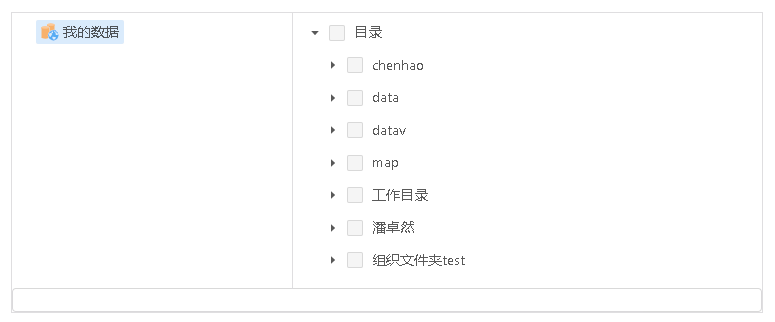
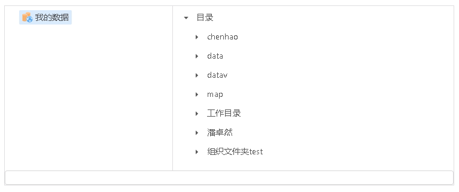

# 从云盘添加图层/工程文件

> mapgis-ui-clouddisk-dataselect




## 何时使用

需要从云盘选取已导入的图层文件，或已保存的工程样式文件时。

选取图层文件支持多选和单选，选取工程文件仅支持单选。

## 1、组件引用示例

```javascript
<template>
  <mapgis-ui-clouddisk-dataselect
    ref="dataselect"
    :multiDatas="true" // 是否可多选
    :currentDocument="currentDocument" // 当前在线制图的document
    :handleNewDocument="handleNewDocument" // 新的document获取成功时的回调
  />
</template>
```

## 2、LocalStorage 要求

由于该组件为业务组件，在引用前需要在 LocalStorage 中存入关键业务信息。

### LocalStorage 设置方式（以设置‘mapgis_clouddisk_ip’为例）

```sh
// window.localStorage.setItem(key, value)

window.localStorage.setItem('mapgis_clouddisk_ip', '192.168.199.53')
```

### LocalStorage 设置项汇总

| key                         | value(示例)                          | 说明             | 是否必填 | 备注                |
| :-------------------------- | :----------------------------------- | ---------------- | -------- | ------------------- |
| mapgis_clouddisk_http       | http                                 | 服务             | 必填项   |                     |
| mapgis_clouddisk_ip         | 192.168.199.53                       | 服务             | 必填项   |                     |
| mapgis_clouddisk_socket     | 9011                                 | 服务             | 必填项   |                     |
| mapgis_clouddisk_group_path | f79ae7b1-8dca-4d37-bd87-14834b1cbf2e | 云盘存储的根路径 | 必填项   |                     |
| mapgis_clouddisk_token      | eyJhbGciOiJIUzUxMiJ9......           | 用户 token       | 必填项   | **需要删除 Bearer** |

## 3、API（参数使用说明）

| 参数              | 说明                                                                               | 是否必填   | 类型   | 默认值 |
| :---------------- | :--------------------------------------------------------------------------------- | :--------- | :----- | :----- |
| multiDatas        | 是否多选（选择图层文件时可设为 true 或 false,选择工程文件时只可设为 false）        | 可选项     | 布尔型 | false  |
| currentDocument   | 当前在线制图的 document                                                            | **必填项** | 对象型 |        |
| handleNewDocument | 组件内部更新 document 时的回调，第一个参数为 payload（payload={document: 新 doc}） | **必填项** | 函数型 |        |
| handleAddLayer    | 外部组件通过 ref 调用，下面有示例                                                  |            |        |        |

## 4、示例代码

```vue
<template>
  <mapgis-ui-modal
    title="从云盘添加数据"
    class="modal-add-clouddisk"
    :width="800"
    :visible="visible"
    :confirm-loading="confirmLoading"
    destroyOnClose
    @ok="handleOk"
    @cancel="handleCancel"
  >
    <mapgis-ui-clouddisk-dataselect
      ref="dataselect"
      :multiDatas="true"
      :currentDocument="currentDocument"
      :handleNewDocument="handleNewDocument"
    />
  </mapgis-ui-modal>
</template>

<script>
export default {
  name: "mapgis-modal-add-clouddisk",
  data() {
    return {
      visible: false,
      confirmLoading: false
    };
  },
  watch: {
    "$store.state.modal.addclouddisk": function(visible) {
      this.visible = visible;
    }
  },
  computed: {
    currentDocument() {
      return this.$store.state.document;
    }
  },
  mounted() {
    const vm = this;
  },
  methods: {
    handleOk(e) {
      if (this.$refs.dataselect) {
        console.warn("发送回调：确定按钮");
        this.$refs.dataselect.handleAddLayer(); // ref示例
      }
      this.closeDialog();
    },
    handleCancel(e) {
      this.closeDialog();
    },
    handleNewDocument(payload) {
      console.warn("得到新document信息：", payload.document);
      this.$store.commit("DOCUMENT_SET_DOCUMENT", payload.document);
    },
    closeDialog() {
      this.$store.commit("MODAL_ADDCLOUDDISK_SET_VISIBLE", false);
    }
  }
};
</script>
```
