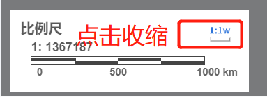

# 收缩卡片 

> mapgis-ui-collapse-card




## 属性

### `outStyle`
- **类型:** `Object`
- **非侦听属性**
- **描述:** 外部传入的自定义样式
- **默认:** 
    ``` json
    {
        right: "10px",
        bottom: "10px"
    }
    ```
- **示例:** 
    ``` json
    {
        position: "absolute",
        left: "10px",
        bottom: "25px",
        height: "fit-content",
        width: "280px"
    }
    ```

### `iconfont`
- **类型:** `String`
- **非侦听属性**
- **描述:** 收缩状态下的图标样式
- **默认:** `mapgis-yingyan`
- **示例:** `mapgis-yingyan`

### `visible`
- **类型:** `Boolean`
- **侦听属性**
- **描述:** 显示状态： 显示/隐藏
- **默认:** `true`

### `position`
- **类型:** `String`
- **侦听属性**
- **描述:** 收缩时隐藏的位置，靠左/靠右收缩
- **默认:** `bottom-right`

## 槽

### `default`
- **描述:** 卡片默认内容槽

### `title`
- **描述:** 卡片Title槽

## 方法

### `show`
- **描述:** 展开该搜索卡片

### `hide`
- **描述:** 收缩该搜索卡片


## 示例
``` vue
<template>
<mapgis-ui-collapse-card
    :style="collapseWraperStyle"
    iconfont="mapgis-bilichi"
    ref="collapsescale"
    position="bottom-left"
    >
    <div class="mapgis-mvt-legend-card-header" slot="title">
        <span class="mapgis-custom-scale-card-title">
        比例尺
        </span>
        <mapgis-ui-iconfont
        class="mapgis-custom-scale-card-toolbar"
        type="mapgis-jibenbilichidixingtutukuang"
        @click="hideCollapseScale"
        />
    </div>
    <mapgis-custom-scale :style="scaleStyle" />
</mapgis-ui-collapse-card>
</template>
<script>
export default {
  name: "mapgis-test-collapse",
  data() {
      return {
        collapseWraperStyle: {
            position: "absolute",
            left: "10px",
            bottom: "25px",
            height: "fit-content",
            width: "280px",
        },
      }
  },
  methods: {
     hideCollapseScale() {
      if (this.$refs.collapsescale) {
        this.$refs.collapsescale.hide();
      }
    }
  }
}
</script>
```
