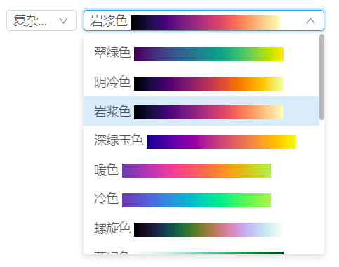
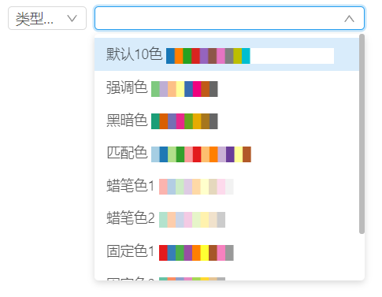

# D3 色板 

> mapgis-ui-d3-colorpick

| 插值函数                            | 分段函数                  |
| :---------------------------------- | :------------------------ |
|  |  |

## 属性

### `size`
- **类型:** `String`
- **非侦听属性**
- **描述:** 外部传入的尺寸大小 small default
- **默认:** small

### `type`
- **类型:** `String`
- **非侦听属性**
- **描述:** 色板类型 
  - 1. interpolates 插值函数色板   
  - 2. schemes分段函数色板
- **默认:** small

## 事件

### `change`

**载荷payload** 

1. icon: 图片
2. key: 键值
3. scheme 色板数组
4. interpolate 插值函数
5. title 名称
6. url 图片网络地址