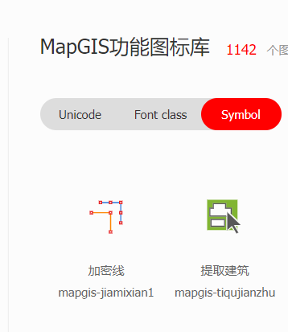
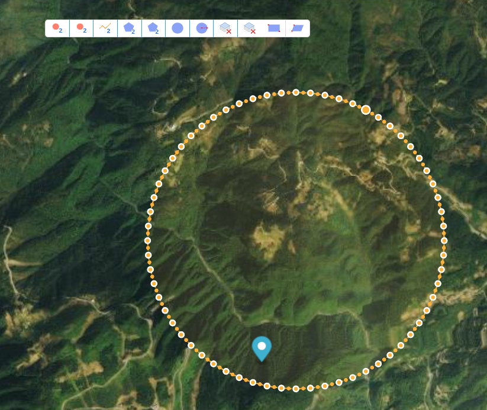
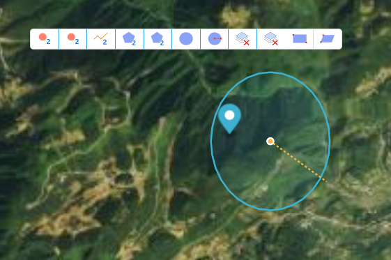

# 图标

> mapgis-ui-iconfont

## 属性

### `type`

- **类型:** `String`
- **非侦听属性**
- **描述:** iconfont 官方网站上对应的图标名称
- **示例:** "mapgis-jiamixian1"



```vue
<mapgis-ui-iconfont type="mapgis-jiamixian1" />
```

## 组合使用

```vue
<template>
  <mapgis-web-map :accessToken="accessToken">
    <mapgis-igs-tdt-layer
      :token="token"
      :baseURL="baseURL"
      :crs="crs"
      :layerId="layerId"
      :sourceId="sourceId"
    >
    </mapgis-igs-tdt-layer>
    <mapgis-draw
      class="custom-draw-wrapper"
      position="bottom-left"
      @added="handleAdded"
      @drawCreate="handleCreate"
      ref="drawref"
    >
      <mapgis-ui-button-group class="mapgis-2d-draw-wrapper">
        <mapgis-ui-tooltip
          v-for="(item, i) in buttons"
          :key="i"
          placement="bottom"
        >
          <template slot="title">
            <span>{{ item.tip }}</span>
          </template>
          <mapgis-ui-button
            circle
            size="small"
            :type="item.type"
            @click="item.click"
          >
            <mapgis-ui-iconfont :type="item.icon" />
          </mapgis-ui-button>
        </mapgis-ui-tooltip>
      </mapgis-ui-button-group>
    </mapgis-draw>
  </mapgis-web-map>
</template>
<style>
.custom-draw-wrapper {
  position: absolute;
  top: 10px;
  right: 10px;
  z-index: 1000;
}
</style>
<script>
export default {
  name: "CustomDraw",
  props: {},
  data() {
    return {
      accessToken:
        "pk.eyJ1IjoibHZ4aW5nZGV0dXppIiwiYSI6ImNrcmJkb3dwMDIycnkycXIyYW96ejQ5czcifQ.RftxemAeBo-0pa-FZqm5vw",
      token: "3af3270f5f558ed33dcf9aacfb7a01b5",
      baseURL: "http://t0.tianditu.gov.cn/img_w/wmts",
      crs: "EPSG:3857",
      layerId: "tdt",
      sourceId: "tdt",
      buttons: [
        {
          icon: "mapgis-erweidian",
          type: "default",
          tip: "点选几何,按住shift可以框选",
          click: this.toggleSimple
        },
        {
          icon: "mapgis-erweidian",
          type: "primary",
          tip: "画点",
          click: this.togglePoint
        },
        {
          icon: "mapgis-erweixian",
          type: "primary",
          tip: "画线",
          click: this.togglePolyline
        },
        {
          icon: "mapgis-erweiqu",
          type: "primary",
          tip: "画矩形",
          click: this.toggleRect
        },
        {
          icon: "mapgis-erweiqu",
          type: "primary",
          tip: "画多边形",
          click: this.togglePolygon
        },
        {
          icon: "mapgis-yuan1",
          type: "primary",
          tip: "画圆",
          click: this.toggleCircle
        },
        {
          icon: "mapgis-yuanxinbanjingyuan1",
          type: "primary",
          tip: "画半径",
          click: this.toggleRadius
        },
        {
          icon: "mapgis-shanchudangqianziceng",
          type: "primary",
          tip: "删除选中图元",
          click: this.toggleDelete
        },
        {
          icon: "mapgis-shanchudangqianziceng",
          type: "primary",
          tip: "删除全部",
          click: this.toggleDeleteAll
        },
        {
          icon: "mapgis-juxing1",
          type: "default",
          tip: "矩形查询",
          click: this.toggleQueryByRect
        },
        {
          icon: "mapgis-pinghangsibianxing1",
          type: "default",
          tip: "多边形查询",
          click: this.toggleQueryByPolygon
        }
      ]
    };
  },
  methods: {
    enableDrawer() {
      const component = this.$refs.drawref;
      if (component) {
        component.enableDrawer();
      }
    },
    handleAdded(e, data) {
      let { drawer, map } = e;
      this.drawer = drawer;
    },
    handleCreate(e) {
      if (this.mode == "QueryByRect" || this.mode == "QueryByPolygon") {
        this.drawer.delete(e.features[0].id);
        // 执行查询操作
      }
    },
    toggleSimple(e) {
      this.enableDrawer();
      this.drawer && this.drawer.changeMode("simple_select");
    },
    toggleDirect(e) {
      this.drawer &&
        this.drawer.changeMode("direct_select", {
          featureId: "" // The id of the feature that will be directly selected (required)
        });
    },
    togglePoint(e) {
      this.enableDrawer();
      this.drawer && this.drawer.changeMode("draw_point");
    },
    togglePolyline() {
      this.enableDrawer();
      this.drawer && this.drawer.changeMode("draw_line_string");
    },
    toggleRect() {
      this.enableDrawer();
      this.drawer && this.drawer.changeMode("draw_rectangle");
    },
    togglePolygon() {
      this.enableDrawer();
      this.drawer && this.drawer.changeMode("draw_polygon");
    },
    toggleCircle() {
      this.enableDrawer();
      this.drawer && this.drawer.changeMode("draw_circle");
    },
    toggleRadius() {
      this.enableDrawer();
      this.drawer && this.drawer.changeMode("draw_radius");
    },
    toggleCombine() {},
    toggleUncombine() {},
    toggleDelete() {
      this.drawer && this.drawer.trash();
    },
    toggleDeleteAll() {
      this.drawer && this.drawer.deleteAll();
    },
    toggleQueryByRect(e) {
      this.enableDrawer();
      this.drawer && this.drawer.changeMode("draw_rectangle");
      this.mode = "QueryByRect";
    },
    toggleQueryByPolygon(e) {
      this.enableDrawer();
      this.drawer && this.drawer.changeMode("draw_polygon");
      this.mode = "QueryByPolygon";
    }
  }
};
</script>
```

### 显示效果:

;

;
