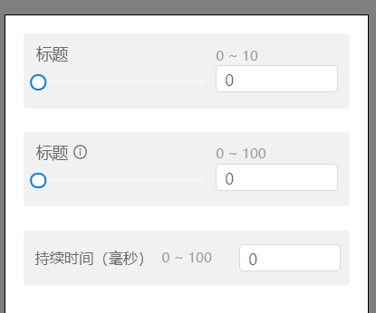

> mapgis-ui-input-number-panel

``` vue
<div>
    <mapgis-ui-input-number-panel
        tooltip="这是提示"
        label="最大分段数"
        v-bind="$props"
    />
    <mapgis-ui-input-number-panel
        size="medium"
        label="最大分段数"
        :labelCol="{ span: 6 }"
        :wrapperCol="{ span: 18 }"
    />
    <mapgis-ui-input-number-panel
        size="small"
        label="最大分段数"
    />
</div>
```

<!-- | 黑暗                            | 浅色                              |
| :------------------------------ | :-------------------------------- |
|  |  | -->

| 大布局                            | 中布局                            | 小布局                            |
| :-------------------------------- | :-------------------------------- | :-------------------------------- |
|  |  |  |

## 属性

### `value`

- **类型:** `Number`
- **v-model属性**
- **描述:** 当前编辑的数值

### `range`

- **类型:** `Array`
- **非侦听属性**
- **描述:** 当前数值的最大最小值
- **默认:** `[0, 100]`

### `tooltip`

- **类型:** `String`
- **非侦听属性**
- **描述:** 提示信息

### `label`

- **类型:** `String`
- **非侦听属性**
- **描述:** 标题

### `slider`

- **类型:** `Boolean`
- **非侦听属性**
- **描述:** 是否显示滑动条
- **默认:** `true`

### `size`

- **类型:** `String`
- **非侦听属性**
- **描述:** 显示布局大小, large、medium 或者 small
- **默认:** `large`

### `labelCol`

- **类型:** `Object`
- **非侦听属性**
- **描述:** 当布局layout是horizontal才生效，表示左侧标题的比例，采取24空格比例
``` json
{ "span": 7 }
```

### `wrapperCol`

- **类型:** `Object`
- **非侦听属性**
- **描述:** 当布局layout是horizontal才生效，表示右侧内容的比例，采取24空格比例
``` json
{ "span": 7 }
```


## 事件
> change(payload)
1. 载荷 payload 修改后的数值

