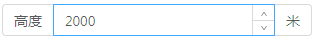

> mapgis-ui-input-number-addon

``` vue
<div>
    <mapgis-ui-input-number-addon v-model="userId" placeholder="Basic usage">
      <mapgis-ui-iconfont slot="addonAfter" type="mapgis-yuanzhui" />
      <mapgis-ui-iconfont slot="addonBefore" type="mapgis-vector" style="color: rgba(0,0,0,.45)" />
    </mapgis-ui-input-number-addon>
    <mapgis-ui-input-number-addon v-model="userId" placeholder="Basic usage">
      <mapgis-ui-iconfont slot="prefix" type="mapgis-yuanzhui" />
      <template #suffix>
        <mapgis-ui-tooltip title="额外信息">
          <mapgis-ui-iconfont type="mapgis-vector" style="color: rgba(0,0,0,.45)" />
        </mapgis-ui-tooltip>
      </template>
    </mapgis-ui-input-number-addon>
</div>
```


| 前后置                           | 前后缀                              |
| :------------------------------ | :-------------------------------- |
|  |  |

## 属性——该组件为`<mapgis-ui-input-number>`的 `超集`，增加了以下4种属性，用法同mapgis-ui-input

### `addonBefore`

- **类型:** `String|slot`
- **非侦听属性**
- **描述:** 带标签的 input-number，设置前置标签

### `addonAfter`

- **类型:** `String|slot`
- **非侦听属性**
- **描述:** 带标签的 input-number，设置后置标签

### `prefix`

- **类型:** `String|slot`
- **非侦听属性**
- **描述:** 带有前缀图标的 input-number

### `suffix`

- **类型:** `String|slot`
- **非侦听属性**
- **描述:** 带有后缀图标的 input-number

