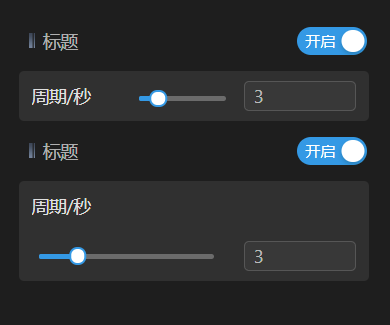
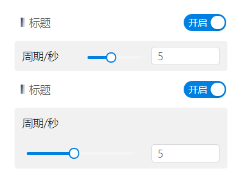
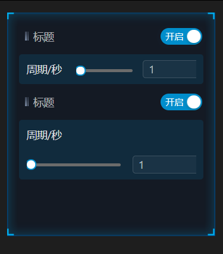
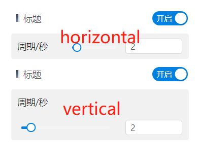

# 区域开关

> mapgis-ui-switch-panel

``` vue
<mapgis-ui-switch-panel layout="horizontal">
    <mapgis-ui-form-model-item label="周期/秒">
        <mapgis-ui-space>
            <mapgis-ui-slider
                v-model="cloudsduration"
                :style="{width: '70px'}"
                :max="10"
                :min="1"
            />
            <mapgis-ui-input-number
                v-model="cloudsduration"
                :max="10"
                :min="1"
                size="small"
            />
        </mapgis-ui-space>
    </mapgis-ui-form-model-item>        
</mapgis-ui-switch-panel>
```

| 黑暗                | 浅色                  | 科技                |
| :------------------ | :-------------------- | :------------------ |
|  |  |  |

## 属性

### `label`

- **类型:** `String`
- **非侦听属性**
- **描述:** 标题

### `checked`

- **类型:** `Boolean`
- **非侦听属性**
- **描述:** 是否展开子菜单

### `layout`

- **类型:** `String`
- **非侦听属性**
- **描述:** 显示布局, horizontal 或者 vertical
  

### `labelCol`

- **类型:** `Object`
- **非侦听属性**
- **描述:** 当布局layout是horizontal才生效，表示左侧标题的比例，采取24空格比例
``` json
{ "span": 7 }
```

### `wrapperCol`

- **类型:** `Object`
- **非侦听属性**
- **描述:** 当布局layout是horizontal才生效，表示右侧内容的比例，采取24空格比例
``` json
{ "span": 7 }
```


