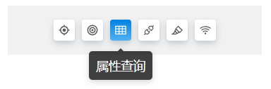

# 区域开关

> mapgis-ui-tab-panel



``` vue
<mapgis-ui-tab-panel :tabs="tabs">
</mapgis-ui-tab-panel>
```

## 属性

### `tabs`

- **类型:** `Array`
- **非侦听属性**
- **描述:** 显示切换的页卡
``` json
[
    {
      "type": "highlight",
      "title": "高亮",
      "icon": "mapgis-target-lock",
    },
    {
      "type": "oid",
      "title": "OID查询",
      "icon": "mapgis-bullseye",
    },
    {
      "type": "properties",
      "title": "属性查询",
      "icon": "mapgis-table",
    }
]
```

## 事件
- **change** 当前激活的页卡信息
- **载荷** payload
- -  
``` json
{
   "type": "highlight",
   "title": "高亮",
   "icon": "mapgis-target-lock",
}
``` 

