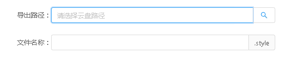

# 保存至云盘
> mapgis-ui-clouddisk-savedocument



## 何时使用

需要将本次工程样式或专题图保存至云盘时。

## 1、组件引用示例

``` javascript
<template>
  <mapgis-ui-clouddisk-savedocument
    ref="savedocument"
    fileType=".style" //后缀，注意加‘.’
    :currentDocumentStr="JSON.stringify(currentDocument)" // 在线制图当前document，转为字符串
    @closeDialog="closeDialog" // 保存成功后的回调，如关闭对话框
    @handleLoading="handleLoading" // 保存出现问题时的回调，如将对话框置为loading
  />
</template>
```

## 2、LocalStorage 要求

由于该组件为业务组件，在引用前需要在LocalStorage中存入关键业务信息。

### LocalStorage设置方式（以设置‘mapgis_clouddisk_ip’为例）

``` sh
// window.localStorage.setItem(key, value)

window.localStorage.setItem('mapgis_clouddisk_ip', '192.168.199.53')
```


### LocalStorage 设置项汇总

|key|value(示例)|说明|是否必填|备注|
|:---|:---|---|---|---|
|mapgis_clouddisk_http|http|上传服务|必填项||
|mapgis_clouddisk_ip|192.168.199.53|上传服务|必填项||
|mapgis_clouddisk_socket|9011|上传服务|必填项||
|mapgis_clouddisk_group_path|f79ae7b1-8dca-4d37-bd87-14834b1cbf2e|云盘存储的根路径|必填项||
|mapgis_clouddisk_token|eyJhbGciOiJIUzUxMiJ9......|用户token|必填项|**需要删除Bearer**|

## 3、API（参数使用说明）

|参数|说明|是否必填|类型|默认值|
|:---|:---|:---|:---|:---|
|fileType|保存的后缀名（注意加“.”）|**必填项**|字符串|'.style'|
|currentDocumentStr|当前在线制图的document,将其转为字符串型|**必填项**|字符串||
|handleSaveDocument|外部组件通过ref调用，下面有示例||||
|@closeDialog|保存任务完成是的回调，里面可以写上关闭对话框等操作|可选项|函数型||
|@handleLoading|对话框需要发生loading时的回调，比如必填项未填全|可选项|函数型||

## 4、示例代码

``` vue
<template>
  <mapgis-ui-modal
    title="导出地图文档"
    class="modal-export"
    :width="600"
    :visible="visible"
    :confirm-loading="confirmLoading"
    @ok="handleOk"
    @cancel="handleCancel"
  >
    <mapgis-ui-clouddisk-savedocument
      ref="savedocument"
      fileType=".style"
      :currentDocumentStr="JSON.stringify(currentDocument)"
      @closeDialog="closeDialog"
      @handleLoading="handleLoading"
    />
  </mapgis-ui-modal>
</template>

<script>

export default {
  name: "mapgis-modal-export",
  data() {
    return {
      visible: false,
      confirmLoading: false,
    };
  },
  watch: {
    "$store.state.modal.export": function(visible) {
      this.visible = visible;
    },
  },
  computed: {
    currentDocument() {
      console.warn("document获取-保存", this.$store.state.document);
      return this.$store.state.document;
    },
  },
  mounted() {
    const vm = this;
  },
  methods: {
    handleOk(e) {
      if (this.$refs.savedocument) {
        this.$refs.savedocument.handleSaveDocument();
      } else {
        this.closeDialog();
      }
    },
    handleLoading(loading) {
      this.confirmLoading = loading;
    },
    handleCancel(e) {
      this.closeDialog();
    },
    closeDialog() {
      this.$store.commit("MODAL_EXPORT_SET_VISIBLE", false);
    },
  },
};
</script>
```
