# 边框

> mapgis-ui-borderbox1 ~ mapgis-ui-borderbox13

边框均由SVG元素绘制，体积轻量不失真，它们的使用极为方便

::: tip 边框内布局
边框组件默认宽高均为100%，边框内部的节点将被slot插槽分发至边框组件下class为border-box-content的容器内，如有布局需要，请针对该容器布局，以免产生样式冲突，导致边框显示异常。
:::

::: warning 注意事项
建议把边框内的节点封装成**组件**，**以组件的形式置入边框**。这是因为slot的渲染机制较为特殊，如果你要在组件mounted后对边框内置入的节点进行页面渲染状态敏感的操作（获取DOM宽高，实例化echarts图表等），可能会发生非预期的结果。比如获取的DOM宽高为0，封装成组件后可避免这种情况。
:::

::: tip 重置宽高
如果边框组件的父容器宽高发生了变化，而边框组件没有侦知这一变化，边框就无法自适应父容器宽高。针对这种情况，你可以给边框绑定key值，在父容器宽高发生变化且完成渲染后更改key值，强制销毁边框组件实例并重新渲染，重新获取宽高。但这会造成边框内的组件同样被销毁重新渲染，这会带来额外的性能消耗，并导致组件状态丢失，此时我们可以调用组件内置的`initWH`方法去重置边框组件的宽高以避免销毁实例重新渲染带来的非预期副作用。
:::

# 自定义颜色
所有边框均支持自定义颜色及背景色，配置项及示例如下。
``` vue
<mapgis-ui-borderbox1 :color="['red', 'green']" backgroundColor="blue" >mapgis-ui-borderbox1</mapgis-ui-borderbox1>
```

## 属性

### `color`
- **类型:** `Array<String>`
- **非侦听属性**
- **描述:** 自定义颜色,支持配置两个颜色，一主一副。颜色类型可以为颜色关键字、十六进制色、RGB及RGBA。
- **默认:** []

### `backgroundColor`
- **类型:** `String`
- **非侦听属性**
- **描述:** 背景色

### mapgis-ui-borderbox1


### mapgis-ui-borderbox2
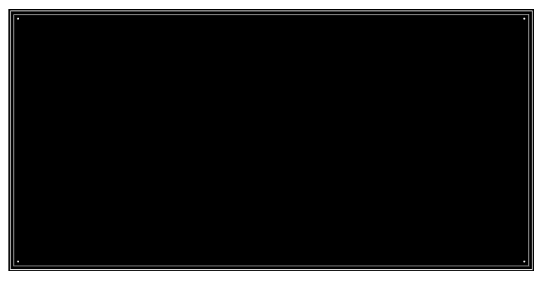

### mapgis-ui-borderbox3
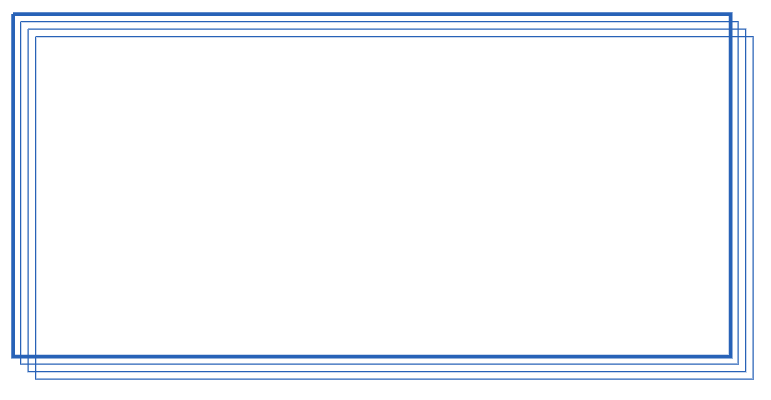

### mapgis-ui-borderbox4
### `reverse`
- **类型:** `Boolean`
- **非侦听属性**
- **描述:** 反向

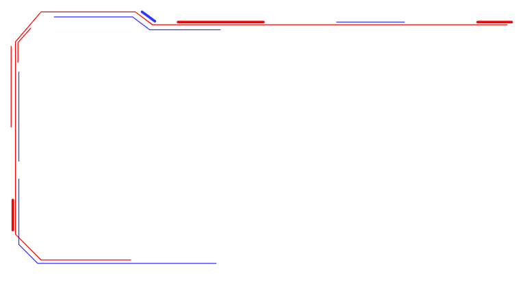
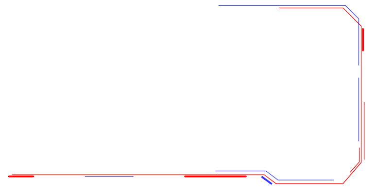

### mapgis-ui-borderbox5
### `reverse`
- **类型:** `Boolean`
- **非侦听属性**
- **描述:** 反向

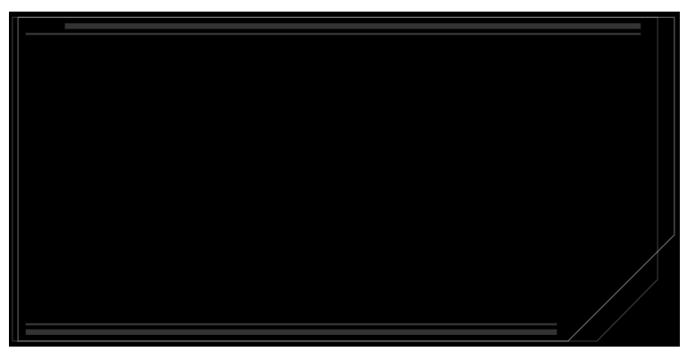
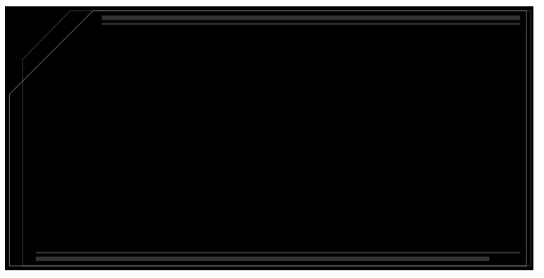

### mapgis-ui-borderbox6


### mapgis-ui-borderbox7


### mapgis-ui-borderbox8
### `reverse`
- **类型:** `Boolean`
- **非侦听属性**
- **描述:** 反向

### `dur`
- **类型:** `Number`
- **非侦听属性**
- **描述:** 单次动画时长(秒)
- **默认值** 3

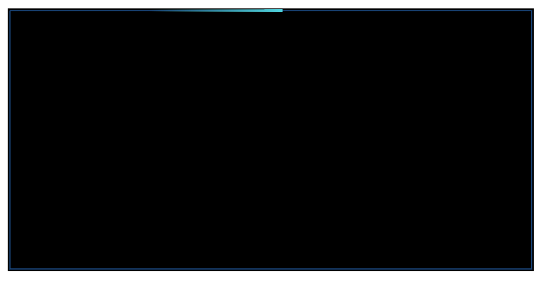
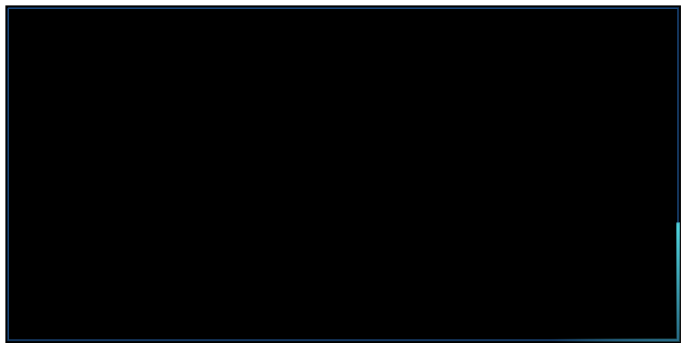

### mapgis-ui-borderbox9
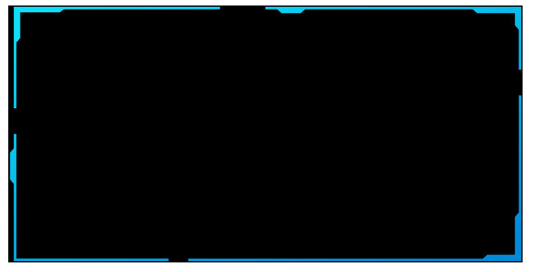

### mapgis-ui-borderbox10


### mapgis-ui-borderbox11
### `title`
- **类型:** `String`
- **非侦听属性**
- **描述:** 边框标题
- **默认值** ''

### `titleWidth`
- **类型:** `Number`
- **非侦听属性**
- **描述:** 标题宽度
- **默认值** 250

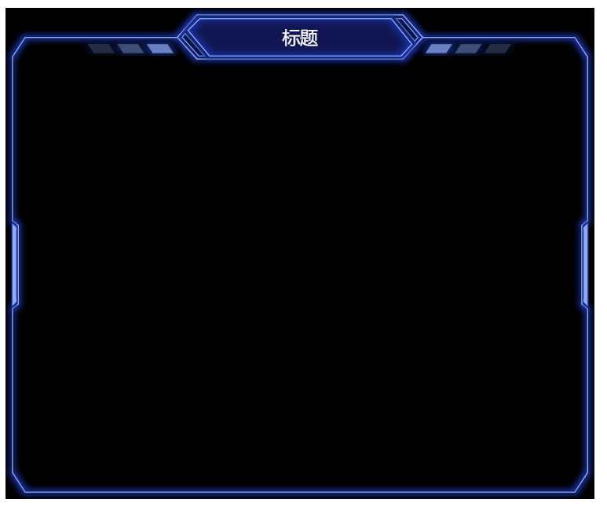

### mapgis-ui-borderbox12
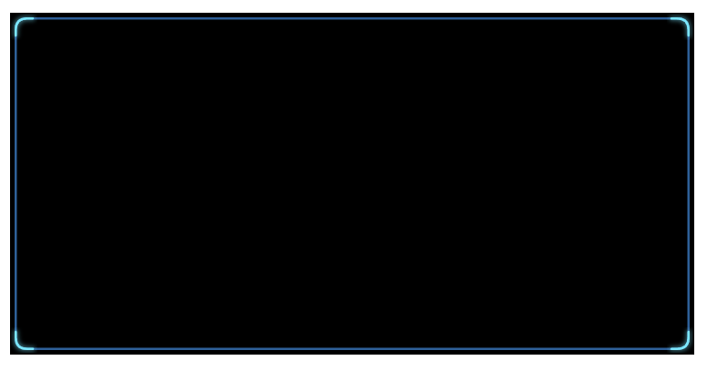

### mapgis-ui-borderbox13
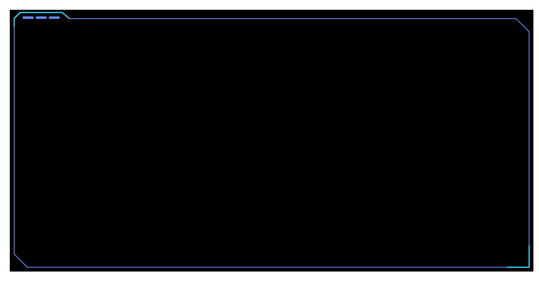
