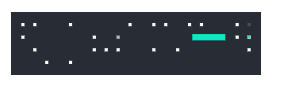
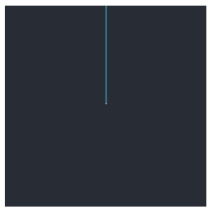
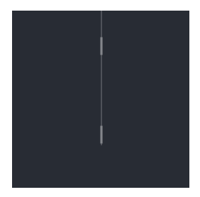
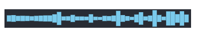
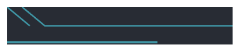
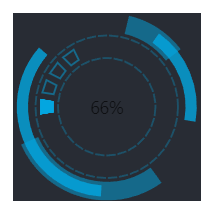
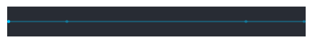
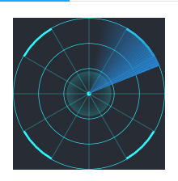

# 装饰

> mapgis-ui-decoration1 ~ mapgis-ui-decoration12

使用装饰去点缀你的页面，以增强视觉效果，与边框组件相同，装饰也是用SVG元素绘制的。

# 自定义颜色
所有装饰均支持自定义颜色，配置项及示例如下。
``` vue
<mapgis-ui-decoration1 :color="['red', 'green']" ></mapgis-ui-decoration1>
```
## 属性

### `color`
- **类型:** `Array<String>`
- **非侦听属性**
- **描述:** 自定义颜色,支持配置两个颜色，一主一副。颜色类型可以为颜色关键字、十六进制色、RGB及RGBA。
- **默认:** []

### mapgis-ui-decoration1


### mapgis-ui-decoration2
### `dur`
- **类型:** `Number`
- **非侦听属性**
- **描述:** 单次动画时长(秒)
- **默认值** 6

### `reverse`
- **类型:** `Boolean`
- **非侦听属性**
- **描述:** 反向




### mapgis-ui-decoration3


### mapgis-ui-decoration4

### `reverse`
- **类型:** `Boolean`
- **非侦听属性**
- **描述:** 反向

### `dur`
- **类型:** `Number`
- **非侦听属性**
- **描述:** 单次动画时长(秒)
- **默认值** 3




### mapgis-ui-decoration5
### `dur`
- **类型:** `Number`
- **非侦听属性**
- **描述:** 单次动画时长(秒)
- **默认值** 1.2


### mapgis-ui-decoration6


### mapgis-ui-decoration7


### mapgis-ui-decoration8
### `reverse`
- **类型:** `Boolean`
- **非侦听属性**
- **描述:** 反向




### mapgis-ui-decoration9
### `dur`
- **类型:** `Number`
- **非侦听属性**
- **描述:** 单次动画时长(秒)
- **默认值** 3



### mapgis-ui-decoration10


### mapgis-ui-decoration11


### mapgis-ui-decoration12
### `scanDur`
- **类型:** `Number`
- **非侦听属性**
- **描述:** 扫描动画时长(秒)
- **默认值** 3

### `haloDur`
- **类型:** `Number`
- **非侦听属性**
- **描述:** 光晕动画时长(秒)
- **默认值** 2



