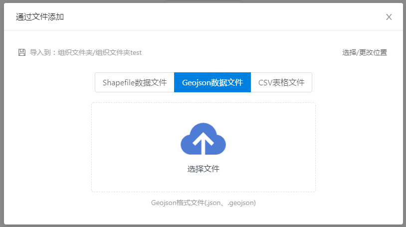

# 上传组件（基于云盘）
> mapgis-ui-global-uploader

> mapgis-ui-upload-modal



## 何时使用

需要上传空间数据文件至云盘时。

另外，目前支持上传shp、csv、geojson格式的文件。

## 1、组件引用示例及说明

上传必须要同时引用两个组件： <u>mapgis-ui-global-uploader</u>和 <u>mapgis-ui-upload-modal</u>。

并且引用<u>mapgis-ui-global-uploader</u>时要注意：① 要采用keep-alive；② 要将其放入项目的全局代码中。以下为简单示例：


``` javascript
<keep-alive> // 必须用keep-alive包裹
  <mapgis-ui-global-uploader
    :clearParam="true" // 加载时是否需要清空clouddiskParam信息
    :clouddiskParam="clouddiskParam" // 业务信息，如ip、端口、token等信息
  />
</keep-alive>
```
``` javascript
<mapgis-ui-upload-modal
  :show="show" // 上传对话框的打开与否
  :title="'通过文件添加'" // 对话框标题
  :width="800" // 宽度（单位px）
  :handleUploaded="handleUploaded" // 当前上传成功的回调
  @cancel="handleCancel" // 点击关闭对话框的回调
>
</mapgis-ui-upload-modal>
```

## 2、API（参数使用说明）

### ① mapgis-ui-global-uploader组件参数
|参数|说明|是否必填|类型|默认值|
|:---|:---|:---|:---|:---|
|clearParam|加载时是否需要清空clouddiskParam信息|可选项，当置为true时，必须填写clouddiskParam|布尔型|false|
|clouddiskParam|业务信息，如ip、端口、token等信息|当clearParam为true时，该参数必填|对象型|{}|

clouddiskParam参数说明：由于该组件为业务组件，在引用前需要填写关键业务信息，这些信息需要通过后台接口获取，包括云盘业务信息如ip、端口、token等，示例和具体说明如下：
``` javascript
this.clouddiskParam = {
  mapgis_clouddisk_http: 'http', // 后面的值通过调之前接口获取
  mapgis_clouddisk_ip: '192.168.23.112',
  mapgis_clouddisk_socket: '9011',
  mapgis_clouddisk_group_path: '434c7c30-1fa3-4736-a1ec-a7ac04b316dd',
  mapgis_clouddisk_token: 'eyJhbGciOiJIUzUxMiJ9.eyJzdWIiOiJtYXBnaXMwM...',
  mapgis_clouddisk_id: 21
}
```
详细说明：
|key|value(示例)|说明|是否必填|备注|
|:---|:---|---|---|---|
|mapgis_clouddisk_http|http|上传服务|必填项||
|mapgis_clouddisk_ip|192.168.199.53|上传服务|必填项||
|mapgis_clouddisk_socket|9011|上传服务|必填项||
|mapgis_clouddisk_group_path|f79ae7b1-8dca-4d37-bd87-14834b1cbf2e|云盘存储的根路径|必填项||
|mapgis_clouddisk_token|eyJhbGciOiJIUzUxMiJ9......|用户token|必填项|**需要删除Bearer**|
|mapgis_clouddisk_id|6|用户ID|必填项||
### ② mapgis-ui-upload-modal组件参数

|参数|说明|是否必填|类型|默认值|
|:---|:---|:---|:---|:---|
|show|上传对话框的打开与否|**必填项**|布尔型|false|
|width|对话框宽度|可选项|数值型|600|
|title|对话框标题|可选项|字符串|‘导入文件’|
|isMapstudio|是否被在线制图所使用，如果为true,则需要同时填写下面两项（currentDocument、handleNewDocument）|可选项|布尔型|false|
|currentDocument|当前在线制图的document|isMapstudio为true时的必填项，否则为可选项|对象型||
|handleNewDocument|组件内部更新document时的回调，第一个参数为payload（payload={document: 新doc}）|isMapstudio为true时的必填项，否则为可选项|函数型||
|handleUploaded|上传完成时的回调|可选项|函数型||
|@cancel|点击关闭按钮的回调|**必填项**|函数型||

## 3、示例代码

``` vue
<template>
  <keep-alive>
    <mapgis-ui-global-uploader />
  </keep-alive>
</template>
```

``` vue
<template>
  <div id="app">
    <p>{{uploadCount}}</p>
    <mapgis-ui-button @click="openModal">点击打开上传对话框</mapgis-ui-button>
    <mapgis-ui-upload-modal
      :show="show"
      :title="'通过文件添加'"
      :width="800"
      :handleUploaded="handleUploaded"
      @cancel="handleCancel"
    >
    </mapgis-ui-upload-modal>
  </div>
</template>

<script>

export default {
  name: 'App',
  data() {
    return {
      show: false,
      uploadCount: 0
    }
  },
  methods: {
    openModal () {
      this.show = true
    },
    handleCancel () {
      // 可在此时更新状态
      this.show = false
    },
    handleUploaded () {
      // 本次上传完成，可在此时更新状态
      console.warn('上传完成！')
      this.uploadCount++
    }
  }
}
</script>
```
