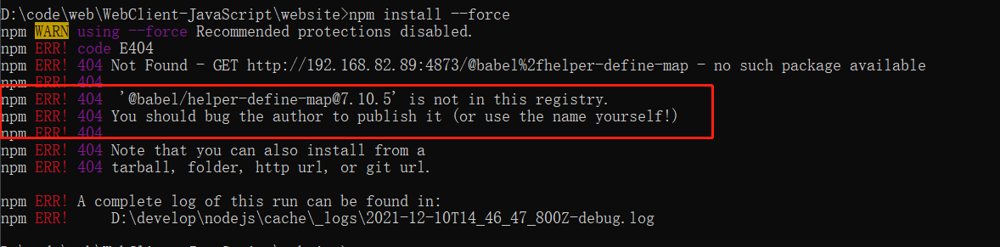

# MapGIS UI

这里是 MapGIS UI 的 Vue 实现，开发和服务于企业级后台产品。

## 特性

1. 提炼自企业级中后台产品的交互语言和视觉风格。
1. 开箱即用的高质量 Vue 组件。
1. 共享 Ant Design of React 设计工具体系。

## 支持环境

1. 现代浏览器
2. 支持服务端渲染。
3. Electron
4. Cordova

## ES6 方式（外网）

使用 npm 或 yarn 安装 #
我们推荐使用 npm 或 yarn 的方式进行开发，不仅可在开发环境轻松调试，也可放心地在生产环境打包部署使用，享受整个生态圈和工具链带来的诸多好处。

```sh
npm install @mapgis/webclient-vue-ui --save
```

```sh
yarn add @mapgis/webclient-vue-ui
```

如果你的网络环境不佳，推荐使用 [cnpm](https://github.com/cnpm/cnpm)。

## 全局引入

```javascript
// main.js
import "@mapgis/webclient-vue-ui/dist-libs/webclient-vue-ui.css";

import mapgisui from "@mapgis/webclient-vue-ui";
```

## 基于内网仓库开发（内网）

内网仓库建议使用 yarn 安装

```sh
npm set registry http://192.168.11.130:4873/   （这里设置yarn的内部仓库源时需要先设置npm的内部，否则容易出问题）
yarn config set registry http://192.168.11.130:4873/
yarn add @mapgis/webclient-vue-ui
# https://github.com/yarnpkg/yarn/issues/4862#issuecomment-368688262
# npm config set registry https://registry.npm.taobao.org // 还原回公网仓库
# yarn config set registry https://registry.npm.taobao.org // 还原回公网仓库
```

::: warning
内网安装建议不要走 npm, npm 很容易出现下面的情况

:::
