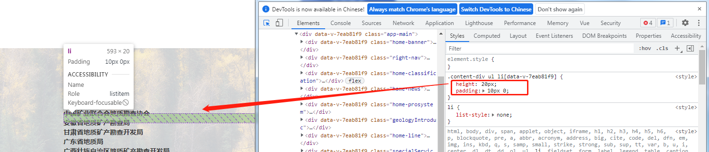
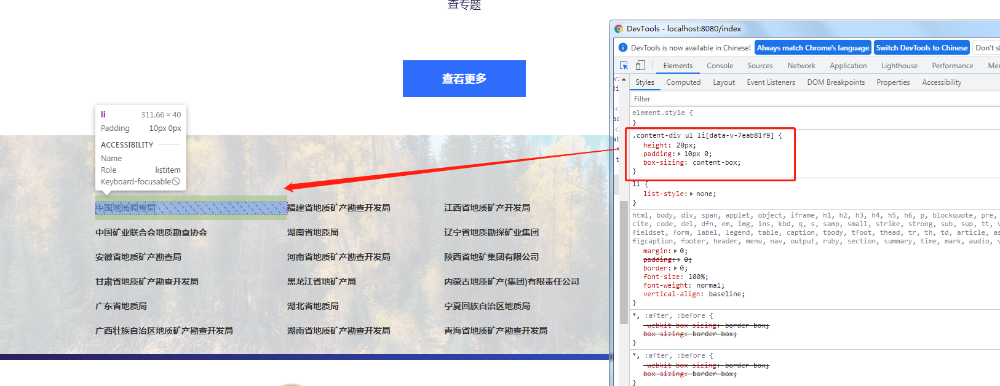

# 解决引入本组件后box-sizing在全局中被设置为了border-box及其导致的样式问题（webclient-vue-mapboxgl同样适用）

本组件所引用的Antd中的antd.css文件将**box-sizing**全局设置为了**border-box**。

因此在某些未使用Antd的项目中，引用本组件后有可能会出现与盒模型相关的样式问题，如下面的示例：

## 错误示例：

说明：下图为引用webclient-vue-ui后的错误界面，在本示例中，由于元素的height和padding均是按照**box-sizing**的默认值**content-box**类型来写的，而本组件的引入导致**box-sizing**被全局设置为了**border-box**，使得该元素的高度由之前正确的**40px**(height+padding)变为了错误的**20px**(height)。




以下为3种解决方案，推荐使用方案1：
## 解决方案1：元素样式设置box-sizing（推荐）

在需要修改的元素的样式中增加一行：
``` css
box-sizing: content-box;
```

例如，以上示例修改为：
``` css
.content-div ul li {
    height: 20px;
    padding: 10px 0;
    box-sizing: content-box; // 增加该行
}
```

修改完成后，可以看到界面正确显示:


## 解决方案2：按照border-box类型来修改元素高度等信息

例如，以上示例经过计算得到**border-box**类型下元素的高度实际为40px，因此修改高度为：
``` css
.content-div ul li {
    height: 40px;  // 修改为实际高度
    padding: 10px 0;
}
```

该方案也可解决此类问题，但某些情况下（如height为100%）修改会相对困难，不建议应用此方案。


## 解决方案3：在项目的App.vue文件中全局设置（慎用）

在项目的App.vue文件的style中加入以下内容：
``` css
*,
*::before,
*::after {
    box-sizing: content-box !important;
}
```

该方案会将全局的**box-sizing**都设置为**content-box**且无法覆盖，容易造成其他样式无法兼容的问题，因此不建议采用此方案。
