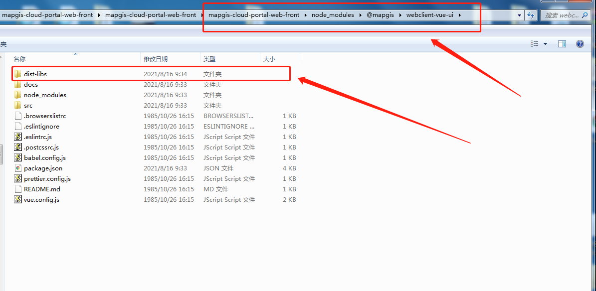

# 解决其他项目引用后打包内存溢出问题

为了解决内存溢出的问题，需要重新按以下方式引用webclient-vue-ui包。

## 步骤1 安装

使用 npm 或 yarn 安装 #
我们推荐使用 npm 或 yarn 的方式进行开发，不仅可在开发环境轻松调试，也可放心地在生产环境打包部署使用，享受整个生态圈和工具链带来的诸多好处。

``` sh
cd /云门户项目路径下

npm install @mapgis/webclient-vue-ui --save

或

yarn add @mapgis/webclient-vue-ui
```

如果你的网络环境不佳，推荐使用 [cnpm](https://github.com/cnpm/cnpm)。

## 步骤2 替换包

<!-- ### 1. 放入部署包 -->

将我们提供的最新部署包，解压后替换到对应目录的dist包（路径：**其他项目/node_modules/@mapgis/webclient-vue-ui/dist-libs**）

如图所示：




## 步骤3 验证

### 1. 运行项目，测试组件是否正常

### 2. 打包项目并测试
