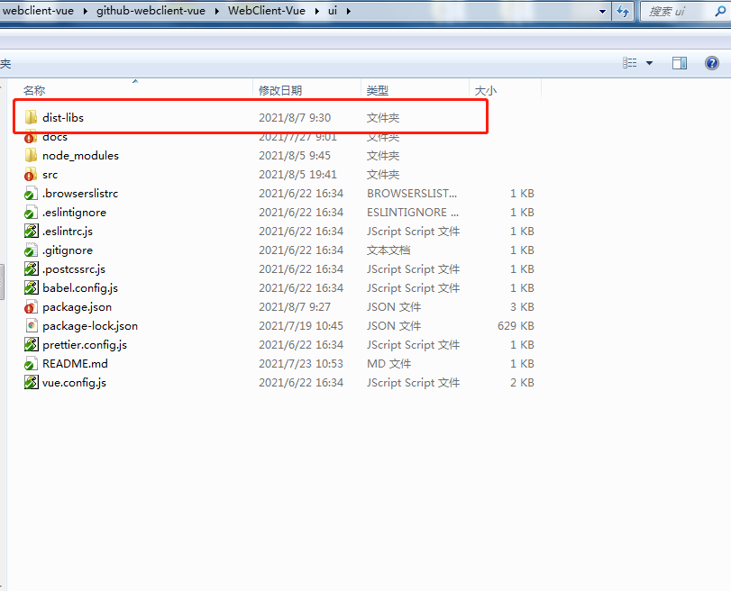

# 本地 link 部署包——开发者

## 步骤 1 clone 代码

代码地址：https://gitee.com/osmapgis/WebClient-Vue、https://github.com/MapGIS/WebClient-Vue

```sh

git clone https://gitee.com/osmapgis/WebClient-Vue.git

或

git clone https://github.com/MapGIS/WebClient-Vue.git
```

## 步骤 2 link 前的准备

### 1. 获取部署包

部署包的获取有两种途径：

#### ① 我们直接提供部署包，解压后放到对应目录下（路径：**/WebClient-Vue/ui/**），如下图：



#### ② 研发人员自行打包，下面为打包步骤：

```sh
cd /WebClient-Vue/ui
npm install
npm run build
```

### 2. 打开 **/WebClient-Vue/ui/package.json** 文件，按下面内容修改第 5-6 行（重点关注第 6 行“module”改为了“module1”），如下所示：

```sh
5   "main": "dist-libs/webclient-vue-ui.umd.min.js",
6   "module1": "src/index.js",
```

## 步骤 3 在其他项目中 link

### 1. 进入 ui 文件夹目录下，并 link 至全局

```sh
cd /WebClient-Vue/ui

npm link
```

### 2. 进入其他项目（如云门户项目），并 link 本组件

```sh
cd /需要引用ui组件的其他项目路径下

npm link @mapgis/webclient-vue-ui
```

## 步骤 4 引用方式（全局引用）

在其他项目中，采用全局引用的方式，下面为示例代码：

```javascript
import Vue from "vue";
import App from "./App.vue";

import "@mapgis/webclient-vue-ui/dist-libs/webclient-vue-ui.css";
import MapgisUi from "@mapgis/webclient-vue-ui";

Vue.config.productionTip = false;

Vue.use(MapgisUi);

new Vue({
  render: h => h(App)
}).$mount("#app");
```

## 注意事项

### 1、由于 link 机制问题，其他项目（如云门户项目）在每次执行了 npm install 或 npm uninstall 后要重新执行下面命令，即重新 link 该组件。

```sh
npm link @mapgis/webclient-vue-ui
```

<!-- ### 2、mockjs问题

待添加...

### 3、其他项目打包时的eslint检测报错

待添加... -->
