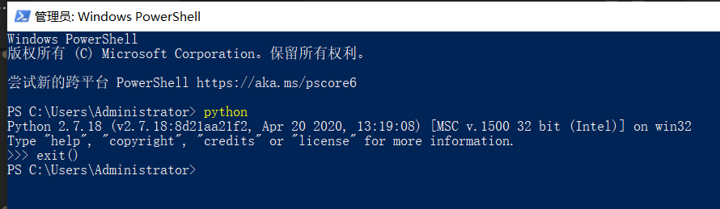
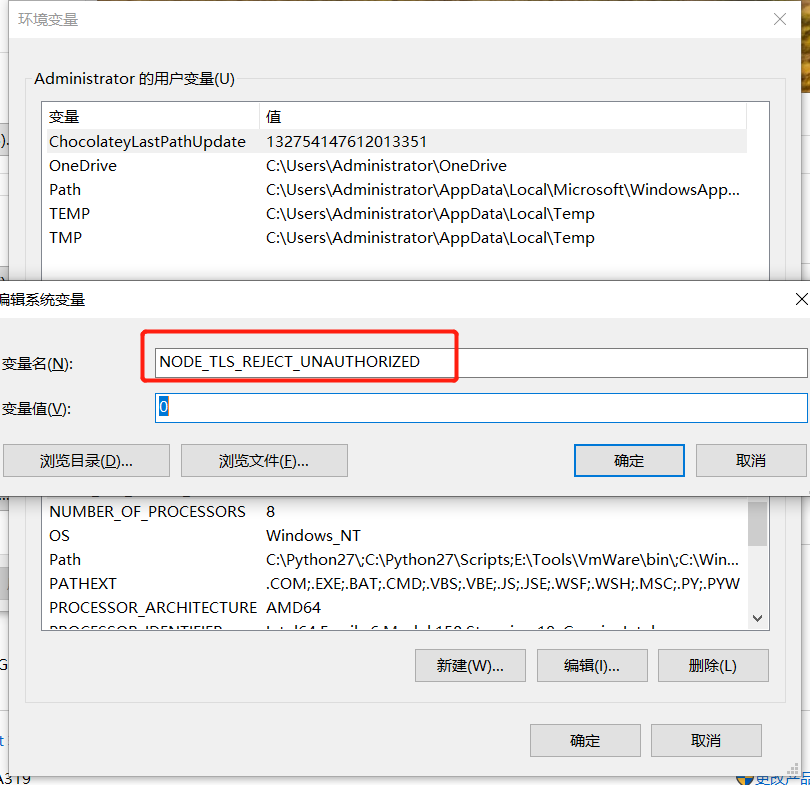

# 本地源使用方式——yarn

## 清空原来的环境设置

1. 下面步骤 2 选 1

   1. 使用下面命令清空

   ```sh
   # yarn
   yarn cache clean
   yarn config delete proxy

   # npm
   npm cache clean --force
   ```

   2. 或者重新安装 nodejs yarn

2. 配置环境变量(必须重启机器才生效！)


3. 检查 yarn node 是否安装


## python (必须重启机器才生效！)

82.44 上复制环境

> \\192.168.82.44\MapGIS 10 开发环境\WebClient\env
> 安装 python2
> `记得一定要把python的path添加到系统环境中`， 在安装的时候可以勾选，安装后也可以主动添加到环境变量中
> 
> 
> 

---

> 使用自己的热点 切记

## 设置本地源方式

> 内网是 `http://192.168.82.89:4873/`

```sh
# yarn
yarn config set registry http://192.168.82.89:4873/
# npm
npm set registry http://192.168.82.89:4873
```

---

> 使用公司的 WIFI 或者继续沿用自己的热点

## 安装 node-sass 依赖示例

```sh
yarn config set sass-binary-site http://npm.taobao.org/mirrors/node-sass
yarn add node-sass sass-loader -g
```

<!-- ::: tip 发布前提示
由于版本号只支持 x.x.x 三位显示，因此需要将之间的版本10.5.5-1 统一修改成10.5.6 或者 10.5.7依次追加序号
::: -->
