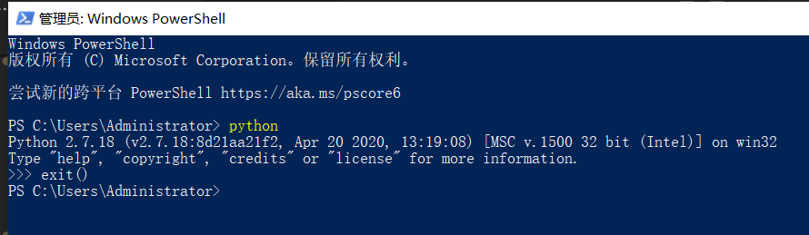
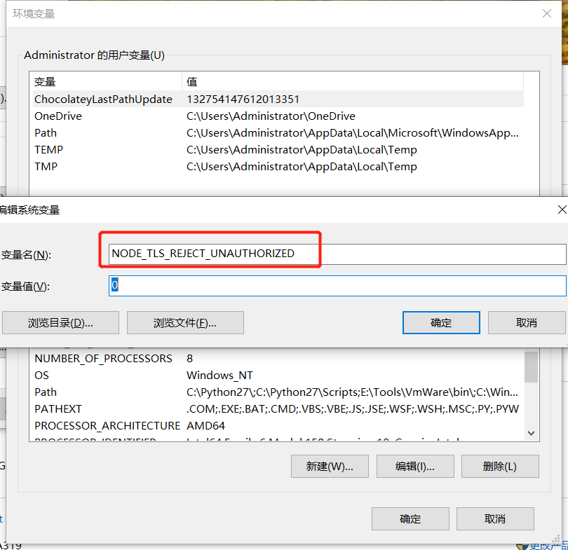

# 公网源混合 MapGIS 源使用方式

## yarn

# 本地源使用方式

## 清空原来的环境设置

1. 下面步骤 2 选 1 推荐 1

   1. 或者重新安装 nodejs yarn
   2. 使用下面命令清空

   ```sh
   # yarn
   yarn cache clean
   yarn config delete proxy

   # npm
   npm cache clean --force
   ```

2. 配置环境变量(必须重启机器才生效！)
   

3. 检查 yarn node 是否安装
   

## python (必须重启机器才生效！)

82.44 上复制环境

> \\192.168.82.44\MapGIS 10 开发环境\WebClient\env
> 安装 python2
> `记得一定要把python的path添加到系统环境中`， 在安装的时候可以勾选，安装后也可以主动添加到环境变量中
> 
> 
> 

---

> 使用自己的热点 切记

## node-sass

```sh
yarn config set sass-binary-site http://npm.taobao.org/mirrors/node-sass
yarn add node-sass sass-loader -g
```

## 设置本地源

> 内网是 `http://192.168.11.130:4873/`

```sh
# yarn
yarn config set registry http://192.168.11.130:4873/
# npm
npm set registry http://192.168.11.130:4873
```

---

> 使用公司的 WIFI 或者继续沿用自己的热点

# 当前 npm 服务指向 本地

```sh
# 注册用户
npm adduser --registry http://192.168.11.130:4873/

# 查看用户
npm who am i

# 发布仓库
npm publish --registry http://192.168.11.130:4873/
```

<!-- ::: tip 发布前提示
由于版本号只支持 x.x.x 三位显示，因此需要将之间的版本10.5.5-1 统一修改成10.5.6 或者 10.5.7依次追加序号
::: -->

1. 安装全局依赖

```sh
yarn global add less@3.12.2 less-loader@7.0.2
```

# 各个库的依赖

## WebClient-JavaScript

1. 删除所有目录下的 yarn.lock 文件
2. 统一使用下面的方式更新仓库

```sh
yarn --registry http://192.168.11.130:4873
```

3. `每次更新库`或者安装依赖都需要增加后缀 --registry http://192.168.11.130:4873/

```sh
  # yarn --registry http://192.168.11.130:4873/
  # yarn add xxx --registry http://192.168.11.130:4873/
  yarn add @mapgis/webclient-es6-service@10.5.5-3 --registry http://192.168.11.130:4873/
```

4. 每次更新仓库
   > 更新前必须本地 yarn build 后生成临时的 dist-libs 替换应用层/测试层的 node_modules 下的 dist-libs 依赖后，保证能够测试程序运行成功才能 publish 操作
   > 避免真实应用出现下面的错误
   > 

```sh
npm publish --registry http://192.168.11.130:4873/
```

## WebClient-Vue

1. 删除所有目录下的 yarn.lock 文件
2. 统一使用下面的方式更新仓库

```sh
yarn --registry http://192.168.11.130:4873
```

3. `每次更新库`或者安装依赖都需要增加后缀 --registry http://192.168.11.130:4873/

```sh
  # yarn --registry http://192.168.11.130:4873/
  # yarn add xxx --registry http://192.168.11.130:4873/
  yarn add @mapgis/webclient-es6-service@10.5.5-3 --registry http://192.168.11.130:4873/
```

4. 每次更新仓库
   > 更新前必须本地 yarn build 后生成临时的 dist-libs 替换应用层/测试层的 node_modules 下的 dist-libs 依赖后，保证能够测试程序运行成功才能 publish 操作
   > 避免真实应用出现下面的错误
   > 

```sh
npm publish --registry http://192.168.11.130:4873/
```

## 三方应用

1. 删除所有目录下的 yarn.lock 文件
2. 统一使用下面的方式更新仓库

```sh
yarn --registry http://192.168.11.130:4873
```

3. `每次更新库`或者安装依赖都需要增加后缀 --registry http://192.168.11.130:4873/

```sh
  # yarn add xxx --registry http://192.168.11.130:4873/
  yarn add @mapgis/webclient-es6-service@10.5.5-3 --registry http://192.168.11.130:4873/

  yarn upgrade @mapgis/webclient-es6-service@10.5.5-3 --registry http://192.168.11.130:4873/
```
