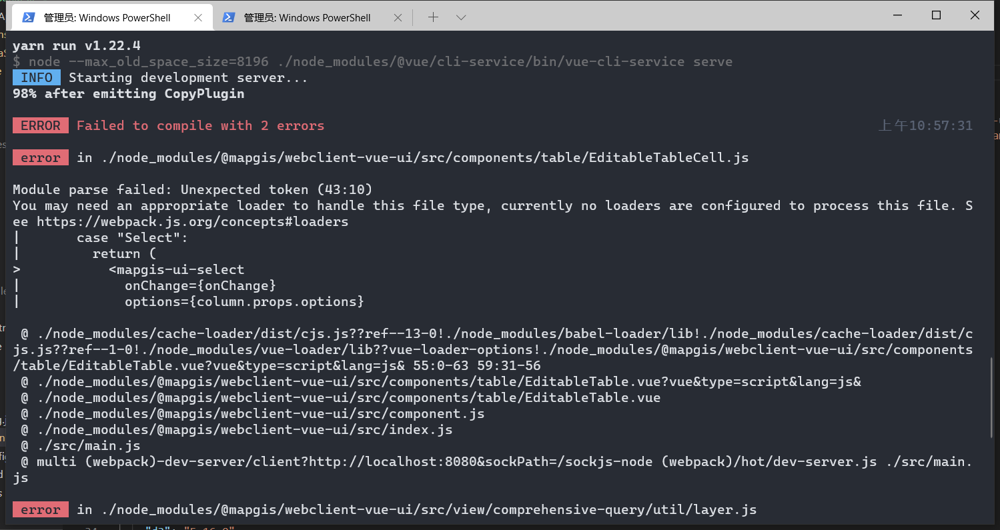

# 发布流程——开发者

## 发布前的准备工作

1. 更新版本号，修改 package.json 中的版本号为最新版本
2. 将 package.json 中的部署包指向 dist-libs，可以删除"module"一行或将其改为"module1"

```sh
5   "main": "dist-libs/webclient-vue-ui.umd.min.js",
6   "module1": "src/index.js",
```

3. 发布前测试
   > 发布前必须本地 yarn build 后生成临时的 dist-libs 替换应用层/测试层的 node_modules 下的 dist-libs 依赖后，保证能够测试程序运行成功才能进行 publish 操作
   > 避免真实应用出现下面的错误

 
  <!--  -->

## 发布内网仓库

```sh
# 设置为mapgis内部源
npm set registry http://192.168.82.89:4873/

# 注册用户
npm adduser --registry http://192.168.82.89:4873/

# 查看用户
npm who am i

# 发布仓库  一定要在对应的发布库的根目录下发布
npm publish --registry http://192.168.82.89:4873/
```

::: tip 仓库过大无法发布
npm config set max_body_size 100mb --registry http://192.168.82.89:4873/
:::

## 发布外网仓库

```sh
# 一定要设置npm官方源，不能使用淘宝镜像源
npm set registry http://www.npmjs.org

# 查看当前所在源
npm config get registry

# 注册用户
npm adduser

# 登录
npm login

# 发布仓库
进入要发布的package.json所在的目录下，发布包(前提：npm账号属于mapgis组织)
npm publish --access public
```

## 使用 nrm 快速切换不同 npm 源

::: tip
在不同的 npm 源地址（如官方源、淘宝源或 mapgis 内部源）之间频繁切换较为繁琐，可以使用 nrm 进行切换与查看
:::

使用方式：

```
下载nrm： npm install -g nrm
切换镜像源： nrm use 镜像名
查看可切换的镜像源： nrm ls(*表示正在使用的镜像源)
```

使用示例

```sh
# npm set registry http://192.168.82.89:4873/
npm install -g nrm
nrm add mapgis http://192.168.82.89:4873/
nrm ls
nrm use mapgis
nrm ls
```

| 查看可切换列表               | 使用                             |
| :--------------------------- | :------------------------------- |
|  |  |
