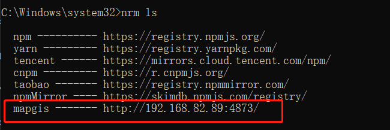
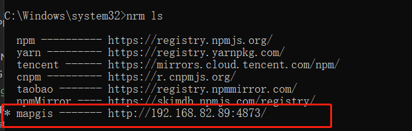
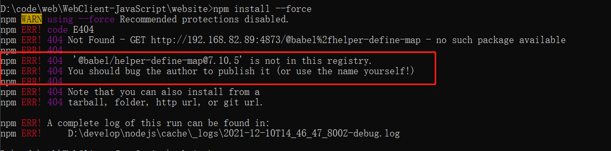

# MapGIS 源使用方式
## 快速使用

``` sh
# npm 
npm config set prefix D:\develop\nodejs\global
npm config set cache D:\develop\nodejs\cache
# yarn 
yarn config set prefix D:\develop\yarn\cache
yarn config set global-folder D:\develop\yarn\global
```

## powershell
``` sh
set-ExecutionPolicy RemoteSigned
```
## yarn
``` sh
yarn config set registry http://192.168.82.89:4873/
# yarn config set registry https://registry.npm.taobao.org // 还原回公网仓库
yarn global add node-gyp
yarn global add node-sass@4.12.0
```

::: tip
强烈建议走yarn的方式，不然很容易出现下面npm的错误情况
:::

## 发布仓库
``` sh
# 设置为mapgis内部源
npm set registry http://192.168.82.89:4873/

# 注册用户
npm adduser --registry http://192.168.82.89:4873/

# 查看用户
npm who am i

# 发布仓库  一定要再对应的发布库的根目录下发布
npm publish --registry http://192.168.82.89:4873/
```
## ~~npm(不建议使用)~~
``` sh
npm set registry http://192.168.82.89:4873/
npm install -g nrm
nrm add mapgis http://192.168.82.89:4873/
nrm use mapgis
npm install -g node-gyp
npm install -g node-sass@4.12.0
```
|列表|使用|
|:---|:---|
|||

::: warning
建议不要走npm, npm很容易出现下面的情况

:::
