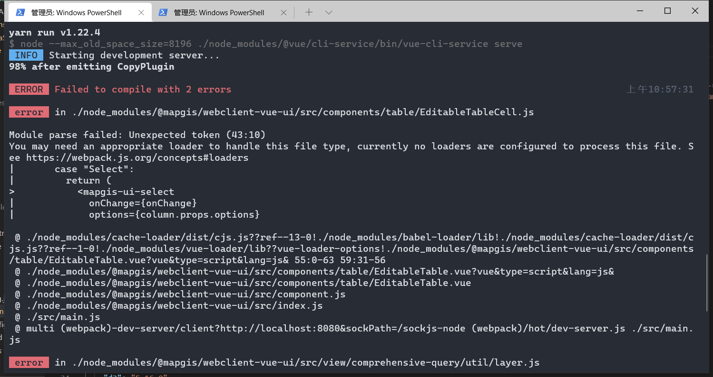

# MapGIS 源使用方式
## 快速使用

``` sh
# npm 
npm config set prefix D:\develop\nodejs\global
npm config set cache D:\develop\nodejs\cache
# yarn 
yarn config set prefix D:\develop\yarn\cache
yarn config set global-folder D:\develop\yarn\global
```

## powershell
``` sh
set-ExecutionPolicy RemoteSigned
```
## yarn
`` sh
yarn config set registry http://192.168.82.89:4873/
yarn global add node-gyp
yarn global add node-sass@4.12.0
``

::: tip
强烈建议走yarn的方式，不然很容易出现下面npm的错误情况
:::
## npm
``` sh
npm set registry http://192.168.82.89:4873/
npm install -g nrm
nrm add mapgis http://192.168.82.89:4873/
nrm use mapgis
npm install -g node-gyp
npm install -g node-sass@4.12.0
```
|列表|使用|
|:---|:---|
|||

::: warning
建议不要走npm, npm很容易出现下面的情况

:::


## yarn 

# 本地源使用方式
## 清空原来的环境设置
1. 下面步骤2选1推荐1
   1. 或者重新安装nodejs yarn
   2. 使用下面命令清空
     ``` sh
     # yarn
     yarn cache clean
     yarn config delete proxy

     # npm 
     npm cache clean --force 
     ```
2. 配置环境变量(必须重启机器才生效！)
  

3. 检查yarn node是否安装
  

## python (必须重启机器才生效！)
82.44上复制环境 
> \\192.168.82.44\MapGIS 10 开发环境\WebClient\env
安装python2
> `记得一定要把python的path添加到系统环境中`， 在安装的时候可以勾选，安装后也可以主动添加到环境变量中


------------------------------------------------------
> 使用自己的热点 切记

## node-sass
``` sh
yarn config set sass-binary-site http://npm.taobao.org/mirrors/node-sass
yarn add node-sass sass-loader -g
```

## 设置本地源
> 内网是 `http://192.168.82.89:4873/`

``` sh
# yarn
yarn config set registry http://192.168.82.89:4873/
# npm
npm set registry http://192.168.82.89:4873
```

------------------------------------------------------
> 使用公司的WIFI或者继续沿用自己的热点

# 当前npm 服务指向 本地
``` sh
# 注册用户
npm adduser --registry http://192.168.82.89:4873/

# 查看用户
npm who am i

# 发布仓库
npm publish --registry http://192.168.82.89:4873/
```

<!-- ::: tip 发布前提示
由于版本号只支持 x.x.x 三位显示，因此需要将之间的版本10.5.5-1 统一修改成10.5.6 或者 10.5.7依次追加序号
::: -->

1. 安装全局依赖
``` sh
yarn global add less@3.12.2 less-loader@7.0.2
```

# 各个库的依赖

## WebClient-JavaScript
1. 删除所有目录下的yarn.lock文件
2. 统一使用下面的方式更新仓库
  ``` sh
  yarn --registry http://192.168.82.89:4873
  ```
3. `每次更新库`或者安装依赖都需要增加后缀 --registry http://192.168.82.89:4873/
  ``` sh
    # yarn --registry http://192.168.82.89:4873/
    # yarn add xxx --registry http://192.168.82.89:4873/
    yarn add @mapgis/webclient-es6-service@10.5.5-3 --registry http://192.168.82.89:4873/
  ```
4. 每次更新仓库
 > 更新前必须本地yarn build后生成临时的dist-libs替换应用层/测试层的node_modules下的dist-libs依赖后，保证能够测试程序运行成功才能publish操作
 > 避免真实应用出现下面的错误
  
  ``` sh
  npm publish --registry http://192.168.82.89:4873/
  ```

## WebClient-Vue
1. 删除所有目录下的yarn.lock文件
2. 统一使用下面的方式更新仓库
  ``` sh
  yarn --registry http://192.168.82.89:4873
  ```
3. `每次更新库`或者安装依赖都需要增加后缀 --registry http://192.168.82.89:4873/
  ``` sh
    # yarn --registry http://192.168.82.89:4873/
    # yarn add xxx --registry http://192.168.82.89:4873/
    yarn add @mapgis/webclient-es6-service@10.5.5-3 --registry http://192.168.82.89:4873/
  ```
4. 每次更新仓库
  > 更新前必须本地yarn build后生成临时的dist-libs替换应用层/测试层的node_modules下的dist-libs依赖后，保证能够测试程序运行成功才能publish操作
  > 避免真实应用出现下面的错误
  
  ``` sh
  npm publish --registry http://192.168.82.89:4873/
  ```

## 三方应用
1. 删除所有目录下的yarn.lock文件
2. 统一使用下面的方式更新仓库
  ``` sh
  yarn --registry http://192.168.82.89:4873
  ```
3. `每次更新库`或者安装依赖都需要增加后缀 --registry http://192.168.82.89:4873/
  ``` sh
    # yarn add xxx --registry http://192.168.82.89:4873/
    yarn add @mapgis/webclient-es6-service@10.5.5-3 --registry http://192.168.82.89:4873/

    yarn upgrade @mapgis/webclient-es6-service@10.5.5-3 --registry http://192.168.82.89:4873/
  ```
