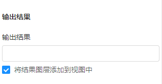
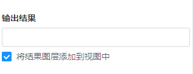

## 1、全局修改

### 修改步骤：

### 1、检查当前组件的`<style>`部分

屏蔽掉当前组件`<style>`中重写的样式，尤其是涉及到`form`的`margin`、`padding`、`font-size`等样式。

```css
::v-deep .mapgis-ui-form label {
  /* font-size: 12px; */
}

::v-deep .mapgis-ui-form-item-label {
  /* line-height: 40px; */
}

::v-deep .mapgis-ui-input {
  /* padding: 4px 11px; */
}
```

### 2、`form-item` 的 `margin-bottom` 要设为0px（若使用 `setting-form` 则忽略该项）

```css
<style scoped>
  .mapgis-ui-form-item {
    margin-bottom: 0px;
  }
</style>
```

### 3、修改表单布局

* 对于普通form（如使用`<mapgis-ui-form>` 或 `<mapgis-ui-form-model>`）：布局统一改为`vertical`
```javascript
/**
 * @type String
 * @default "vertical"
 * @description 表单布局
 */
layout: {
  type: String,
  default: "vertical" // 'horizontal' 'vertical' 'inline'
},
```

* 对于`<mapgis-ui-setting-form>`:
```javascript
<mapgis-ui-setting-form
  // :label-width="50" // 删掉
  // :wrapper-width="224" // 删掉
  :layout="layout" // 增加
  size="default" // 增加
  class="mapgis-ui-setting-form"
>
...
layout: {
  type: String,
  default: "vertical" // 'horizontal' 'vertical' 'inline'
}
```

### 4、组内只有一项内容的情况

`form-item` 部分删掉 `label`；并将`<mapgis-ui-group-tab>`的`hasBottomMargin`设置为`false`

::: tip
修改示例：
> 修改前：
> ```javascript
> <mapgis-ui-group-tab
>   title="输出结果"
> />
> <mapgis-ui-form-model-item
>   label="输出结果"
> >
> ...
> </mapgis-ui-form-model-item>
> ```
> 

> 修改后：
> ```javascript
> <mapgis-ui-group-tab
>   title="输出结果"
>   :hasBottomMargin="false" // 增加该行
> />
> <mapgis-ui-form-model-item
>   // label="输出结果" // 删除该行
> >
> ...
> </mapgis-ui-form-model-item>
> ```
> 
:::

### 5、checkbox自成一行的情况（见上图）

将`line-height`设置为32px：

```javascript
<mapgis-ui-checkbox
  style="line-height:32px;" // 增加该行
  :default-checked="bufferAdd"
  @change="sendBufferAdd"
>
  将结果图层添加到视图中
</mapgis-ui-checkbox>
```

## 2、细节修改

### 见[组件开发样式规范说明](../plugin_components/new_form_model.html#_3、细节优化)
