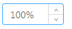

## 1、表单布局规范基本原则

* 表单采用垂直布局；
* 表单项分组展示，组标题设置加粗、上下间距（margin）8px；当组内仅有一项内容时，只加粗标题、不再设置间距；
* 输入框前缀统一用图标、后缀统一用单位；

## 2、全局修改

### 修改步骤：

#### 1、检查当前组件的`<style>`部分

屏蔽掉当前组件`<style>`中重写的样式，尤其是涉及到`form`的`margin`、`padding`、`font-size`等样式。

```css
::v-deep .mapgis-ui-form label {
  /* font-size: 12px; */
}

::v-deep .mapgis-ui-form-item-label {
  /* line-height: 40px; */
}

::v-deep .mapgis-ui-input {
  /* padding: 4px 11px; */
}
```

#### 2、`form-item` 的 `margin-bottom` 要设为0px（若使用 `setting-form` 则忽略该项）

```css
<style scoped>
  .mapgis-ui-form-item {
    margin-bottom: 0px;
  }
</style>
```

#### 3、修改表单布局

* 对于普通form（如使用`<mapgis-ui-form>` 或 `<mapgis-ui-form-model>`）：布局统一改为`vertical`
```javascript
/**
 * @type String
 * @default "vertical"
 * @description 表单布局
 */
layout: {
  type: String,
  default: "vertical" // 'horizontal' 'vertical' 'inline'
},
```

* 对于`<mapgis-ui-setting-form>`:
```javascript
<mapgis-ui-setting-form
  // :label-width="50" // 删掉
  // :wrapper-width="224" // 删掉
  :layout="layout" // 增加
  size="default" // 增加
  class="mapgis-ui-setting-form"
>
...
layout: {
  type: String,
  default: "vertical" // 'horizontal' 'vertical' 'inline'
}
```

#### 4、组内只有一项内容的情况

`form-item` 部分删掉 `label`、并设置 `margin-top` 为-8px

> 修改前：
> ```javascript
> <mapgis-ui-form-model-item
>   label="输出结果"
> >
> ...
> </mapgis-ui-form-model-item>
> ```
> 

> 修改后：
> ```javascript
> <mapgis-ui-form-model-item
>   // label="输出结果" // 删除该行
>   style="margin-top:-8px;" // 增加该行
> >
> ...
> </mapgis-ui-form-model-item>
> ```
> 

#### 5、checkbox自成一行的情况（见上图）

将`line-height`设置为32px：

```javascript
<mapgis-ui-checkbox
  style="line-height:32px;" // 增加该行
  :default-checked="bufferAdd"
  @change="sendBufferAdd"
>
  将结果图层添加到视图中
</mapgis-ui-checkbox>
```

## 3、细节优化

#### 1、[颜色条](../api/panel/color_pick.html)

* 将 `<mapgis-ui-color-pick-panel>` 的`labelCol`和`wrapperCol`均设为24
```javascript
<mapgis-ui-color-pick-panel
  label="轮廓颜色"
  :color="colorCopyLine"
  :labelCol="24" // 修改该行
  :wrapperCol="24" // 修改该行
  :size="size"
  :disableAlpha="false"
  :colorStyle="colorStyle"
  @input="val =>
    (colorCopyLine = `rgba(${val.rgba.r}, ${val.rgba.g}, ${val.rgba.b}, ${val.rgba.a})`)"
>
</mapgis-ui-color-pick-panel>
```

* 根据实际情况决定是否显示颜色值（通过设置 `showColorText`为`true/false`）

#### 2、[数字输入框](../api/panel/inputnumberaddon.html)

* `<mapgis-ui-input-number-addon>`支持前后置和前后缀（即`addonAfter`、`addonBefore`、`prefix`、`suffix`），用法同`<mapgis-ui-input>`
* 统一将`<mapgs-ui-input type="number">`替换为`<mapgis-ui-input-number-addon>`
* 以前的`<mapgis-ui-input>`必须填数字的情况也替换为`<mapgis-ui-input-number-addon>`
* 推荐将度（°）、百分号（%）等特殊单位紧贴在数字之后显示（`formatter`、`parser`配合使用）：     
```javascript
<mapgis-ui-input-number
  :default-value="100"
  :min="0"
  :max="100"
  :formatter="value => `${value}%`"
  :parser="value => value.replace('%', '')"
  @change="onChange"
/>
```

#### 3、[数字输入框+滑动条](../api/panel/inputnumber.html)

* 将`<mapgis-ui-input-number-panel>`的`size`设为`large`

## 4、其他

#### 1、关于整体布局的高度、宽度

