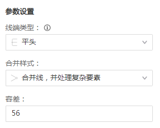
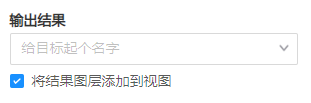
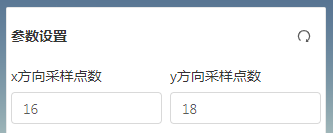
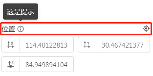
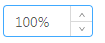
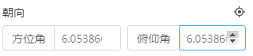
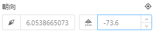
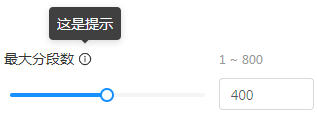
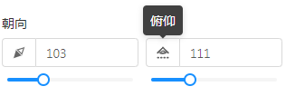

## 1、表单布局规范基本原则

* 表单采用垂直布局；
* 表单项分组展示，组标题设置为加粗、上下间距（margin）8px；若组内仅有一项内容时，不单独添加子标题，只需加粗组标题并设置上间距为8px；

| 组内有多项内容                   | 组内仅一项                         |
| :------------------------------ | :-------------------------------- |
|        |       |

* 输入框前缀（可选）统一用图标、后缀（可选）统一用单位（单位不需要用括号包裹）；

## 2、整体布局

### 1、设置表单布局为垂直布局

* 推荐使用基本form组件（如`<mapgis-ui-form>` 、 `<mapgis-ui-form-model>`）或`<mapgis-ui-setting-form>`组件：布局均统一设为`vertical`
```javascript
<mapgis-ui-form
  :layout="layout"
>
或
<mapgis-ui-form-model
  :layout="layout"
>
或
<mapgis-ui-setting-form
  // :label-width="50" // 删掉
  // :wrapper-width="224" // 删掉
  :layout="layout"
  size="default"
>

props: {
  /**
   * @type String
   * @default "vertical"
   * @description 表单布局
   */
  layout: {
    type: String,
    default: "vertical" // 'horizontal' 'vertical' 'inline'
  },
}
```

### 2、组件中`form-item` 的 `margin-bottom` 设为0px（若使用 `<mapgis-ui-setting-form>` 则忽略该项）

```css
<style scoped>
  .mapgis-ui-form-item {
    margin-bottom: 0px;
  }
</style>
```

### 3、组内只有一项内容的情况

将`<mapgis-ui-group-tab>`的`hasBottomMargin`设置为`false`；且`form-item` 部分不需要设置 `label`

::: tip
示例：
> ```javascript
> <mapgis-ui-group-tab
>   title="输出结果"
>   :hasBottomMargin="false" // 设置hasBottomMargin
> />
> <mapgis-ui-form-model-item
>   // label="输出结果" // 不需要设置label
> >
> ...
> </mapgis-ui-form-model-item>
> ```
> 
:::

### 4、checkbox自成一行的情况（见上图）

将`line-height`设置为32px：

```javascript
<mapgis-ui-checkbox
  style="line-height:32px;" // 增加该行
  :default-checked="bufferAdd"
  @change="sendBufferAdd"
>
  将结果图层添加到视图中
</mapgis-ui-checkbox>
```

## 3、细节优化


### 1、tooltip

* 将`<mapgis-ui-tooltip>`的`placement`统一设为`top`

### 2、同一行并列显示两项

> 同一类数据，且数据长度较短时，为节省高度，可并列显示（如数值类、颜色类，可选择此种布局）


* 为确保间距等符合规范，建议统一使用栅格布局（`<mapgis-ui-row>`和`<mapgis-ui-col>`）
* 请严格按照示例中gutter、span的值设置；若出现横向滚动条，可将其隐藏

```javascript
<mapgis-ui-row :gutter="8">
  <mapgis-ui-col :span="12">	
    <mapgis-ui-form-item label="x方向采样点数">
      <mapgis-ui-input-number-addon/>
    </mapgis-ui-form-item>
  </mapgis-ui-col>
  <mapgis-ui-col :span="12">
    <mapgis-ui-form-item label="y方向采样点数">
      <mapgis-ui-input-number-addon/>
    </mapgis-ui-form-item>
  </mapgis-ui-col>
</mapgis-ui-row>

<style scoped>
.mapgis-widget-cut-fill-analysis {
  max-height: calc(50vh);
  overflow-y: auto;
  overflow-x: hidden; // 隐藏横向滚动条
}
</style>
```

### 3、标签有多个附加项的情况

> 释义图标放在表单字段旁；操作按钮放在字段右侧，右对齐


* 推荐使用`<mapgis-ui-group-tab>`的`tip`、`handle`两个插槽实现
* 需要将标题的`isTitleBold`、`hasTopMargin`、`hasBottomMargin`全部设为`false`

```javascript
<mapgis-ui-group-tab title="位置" :isTitleBold="false" :hasTopMargin="false" :hasBottomMargin="false">
  <mapgis-ui-tooltip slot="tip" placement="top" title="这是提示">
    <mapgis-ui-iconfont type="mapgis-info" />
  </mapgis-ui-tooltip>
  <mapgis-ui-tooltip slot="handle" title="定位">
    <mapgis-ui-iconfont
      type="mapgis-target-lock"
      @click="_getCameraPosition"
    />
  </mapgis-ui-tooltip>
</mapgis-ui-group-tab>
```

### 4、底部按钮

* 底部按钮统一使用`<mapgis-ui-setting-footer>`组件，且表单过长时按钮要固定在弹框底部，不能随滚动条移动

### 5、[数字输入框](../api/panel/inputnumberaddon.html)

> `<mapgis-ui-input-number-addon>`支持前后置和前后缀（即`addonAfter`、`addonBefore`、`prefix`、`suffix`），用法同`<mapgis-ui-input>`
* 统一将`<mapgs-ui-input type="number">`的写法改为使用`<mapgis-ui-input-number-addon>`
* 推荐将度（°）、百分号（%）等特殊单位紧贴在数字之后显示（通过设置`formatter`、`parser`）：     
```javascript
<mapgis-ui-input-number
  :default-value="100"
  :min="0"
  :max="100"
  :formatter="value => `${value}%`"
  :parser="value => value.replace('%', '')"
  @change="onChange"
/>
```

::: tip
`<mapgis-ui-input-number-addon>`使用示例（根据规范，输入框若有前缀则统一使用图标）
> 修改前：
> ```javascript
> <mapgis-ui-input
>   type="number"
>   addon-before="方位角"
>   :min="0"
>   :max="360"
>   :step="0.1"
>   v-model.number="params.orientation.heading"
>   @change="val => onChangeSetting(val.target.value, 'heading')"
> />
> ```
> 

> 修改后：
> ```javascript
> <mapgis-ui-input-number-addon
>   :min="0"
>   :max="360"
>   :step="0.1"
>   v-model.number="params.orientation.heading"
>   @change="val => onChangeSetting(val, 'heading')" // 注意函数参数
> >
>   <mapgis-ui-tooltip slot="addonBefore" title="方位角">
>     <mapgis-ui-iconfont type="mapgis-fangwei"/>
>   </mapgis-ui-tooltip>
> </mapgis-ui-input-number-addon>
> ```
> 
:::

::: warning
注意事项：需要注意`<mapgis-ui-input>`和`<mapgis-ui-input-number>`两者的`@change`回调函数的参数不同。

前者为event（使用event.target.value得到输入值），后者为value（输入值）。
:::

### 6、[数字输入框+滑动条](../api/panel/inputnumber.html)

* 支持以下两种展示方式

① 独立一行展示时，使用`<mapgis-ui-input-number-panel>`（将`size`设为`large`）
```javascript     
<mapgis-ui-input-number-panel
  tooltip="这是提示"
  size="large"
  label="最大分段数"
  :range="[1, 800]"
  v-model="maxSegmentedValueCopy"
/>
```


② 同一行有两个输入框并列展示时，直接将输入框和滑动条上下布局展示
```javascript
<mapgis-ui-col :span="12">
  <mapgis-ui-input-number-addon v-model.number="angleSet.pitch" >
    <mapgis-ui-tooltip slot="addonBefore" title="俯仰">
      <mapgis-ui-iconfont type="mapgis-fushi"/>
    </mapgis-ui-tooltip>
  </mapgis-ui-input-number-addon>
  <mapgis-ui-slider v-model="angleSet.pitch" />
</mapgis-ui-col>
```


### 7、[颜色条](../api/panel/color_pick.html)

* 根据实际情况决定是否显示颜色值文本（通过设置 `showColorText`为`true/false`）
* 将 `<mapgis-ui-color-pick-panel>` 的`labelCol`和`wrapperCol`均设为24
```javascript
<mapgis-ui-color-pick-panel
  label="轮廓颜色"
  :labelCol="24" // 修改该行
  :wrapperCol="24" // 修改该行
  :disableAlpha="false"
  @input="val =>
    (colorCopyLine = `rgba(${val.rgba.r}, ${val.rgba.g}, ${val.rgba.b}, ${val.rgba.a})`)"
>
</mapgis-ui-color-pick-panel>
```


## 4、其他

### 1、关于弹框的高度、宽度
* 弹框宽度固定为320px
* 弹框高度自适应，不可超过屏幕底部（表单过长时设为距底部5%）
