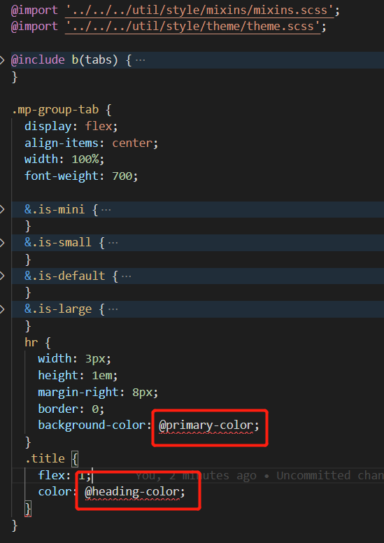

# 一张图组件移植

## 已移植组件

| 原始名称              | 新名称                                | 问题                                       | 所在文件夹      | 已补充 storybook | 涉及 a-icon |
| :-------------------- | :------------------------------------ | :----------------------------------------- | :-------------- | :--------------- | :---------- |
| MpImgCheckbox         | mapgis-ui-img-checkbox                |                                            | checkbox        | √                | √           |
| MpImgCheckboxGroup    | mapgis-ui-img-checkbox-group          |                                            | checkbox        | √                |             |
| MpColorCheckbox       | mapgis-ui-color-checkbox              | 未找到\$base-bg-color                      | checkbox        | √                | √           |
| MpColorCheckboxGroup  | mapgis-ui-color-checkbox-group        |                                            | checkbox        | √                |             |
| MpSpin                | mapgis-ui-map-spin                    |                                            | spin            | -                |             |
| MpMask                | mapgis-ui-mask                        |                                            | mask            | √                |             |
| MpCollapseButton      | mapgis-ui-collapse-button             | 未找到$base-bg-color未找到$border-color    | collapse        | -                | √           |
| MpAdjustLine          | mapgis-ui-adjust-line                 | 未找到$base-bg-color未找到$border-color    | adjust-line     | -                |             |
| MpGroupTab            | mapgis-ui-group-tab                   |                                            | tabs            | √                |             |
| MpSettingForm         | mapgis-ui-setting-form                |                                            | form            | √                |             |
| MpTreeSelect          | mapgis-ui-custom-tree-select          |                                            | tree-select     | -                | √           |
| MpColorPicker         | mapgis-ui-sketch-color-picker         |                                            | color-picker    | -                |             |
| MpColorPickerConfirm  | mapgis-ui-sketch-color-picker-confirm | $size-lg、$size-md、\$size-sm 需要放到全局 | color-picker    | -                |             |
| MpWindow              | mapgis-ui-window                      | 未找到$base-bg-color未找到$border-color    | window          | -                | √           |
| MpWindowWrapper       | mapgis-ui-window-wrapper              |                                            | window          | -                |             |
| MpPlacement           | mapgis-ui-placement                   |                                            | placement       | -                |             |
| MpIcon                | mapgis-ui-icon                        |                                            | iconfont        | √                |             |
| MpButton              | mapgis-ui-tooltip-button              |                                            | button          | √                |             |
| MpCard                | mapgis-ui-command-card                |                                            | card            | √                |             |
| MpEditableTable       | mapgis-ui-editable-table              |                                            | table           | √                | √           |
| MpRowFlex             | mapgis-ui-row-flex                    |                                            | grid            | √                |             |
| MpToolbar             | mapgis-ui-toolbar                     |                                            | toolbar         |                  |             |
| MpToolbarSpace        | mapgis-ui-toolbar-space               |                                            | toolbar         |                  |             |
| MpToolbarTitle        | mapgis-ui-toolbar-title               |                                            | toolbar         |                  |             |
| MpToolbarCommand      | mapgis-ui-toolbar-command             |                                            | toolbar         |                  | √           |
| MpToolbarCommandGroup | mapgis-ui-toolbar-command-group       |                                            | toolbar         |                  |             |
| MpMarkerPlotting      | mapgis-dynamic-marker-layer           |                                            | mapboxgl/marker |                  | √           |
| MpMarkerPro           | mapgis-marker-pro                     |                                            | mapboxgl/marker |                  |             |
| MpMarkerSetPro        | mapgis-marker-set-pro                 |                                            | mapboxgl/marker |                  |             |
| Mp3dMarkerPlotting    | mapgis-3d-dynamic-marker-layer        |                                            | cesium/marker   |                  | √           |
| Mp3dMarkerPro         | mapgis-3d-marker-pro                  |                                            | cesium/marker   |                  |             |
| Mp3dMarkerSetPro      | mapgis-3d-marker-set-pro              |                                            | cesium/marker   |                  |             |

## 样式变量问题汇总

若遇到`ui\src\util\style\theme\theme.scss`里找不到的样式变量，可填写至下表。（本 md 文件路径：`ui\docs\plugin_components\onemap.md`）。

| theme.scss 中未找到 | 局部已有定义，需要放到 theme.scss |
| :------------------ | :-------------------------------- |
| \$base-bg-color     | \$size-lg                         |
| \$border-color      | \$size-md                         |
|                     | \$size-sm                         |

## 注

1、Select、Input 组件已添加属性：`autoWidth`，设置为 true 时可实现宽度 100% 自适应。

2、Card 组件已添加属性：`customPosition`，可控制卡片显示的绝对位置：

```javascript
customPosition: {
  type: String,
  default: '',
  validator: v =>
    [
      'top-right',
      'top-left',
      'bottom-right',
      'bottom-left'
    ].includes(v)
},
```

3、`<mapgis-ui-form>`和`<mapgis-ui-form-item>`组件已封装完成！！！

## 组件分析

以地形组件为例

::: tip

> terrain-analysis/aspect-analysis.vue
> 该组件核心三部分
>
> 1. 模板 `<template />`
> 2. 代码 `<ts />` 三方库 ts 实现
> 3. 样式 `<less />`
>    :::

```vue
<template>
  <div class="mp-widget-aspect-analysis">
    <mp-group-tab title="坡向图例设置">
      <a-tooltip slot="handle" placement="bottomRight" :title="info">
        <a-icon type="info-circle" class="info-icon"></a-icon>
      </a-tooltip>
    </mp-group-tab>
    <MpColorsSetting
      v-model="params"
      :rangeField="'坡向范围'"
    ></MpColorsSetting>
    <div class="mp-footer-actions">
      <a-button type="primary" @click="add">分析</a-button>
      <a-button @click="remove">清除</a-button>
    </div>
  </div>
</template>

<script lang="ts"></script>

<style lang="less" scoped>
@import "../index.less";

.info-icon {
  color: @primary-6;
  width: 27px;
  margin: 0 6px;
  text-align: center;
  cursor: pointer;
}
</style>
```

# 步骤

1. 抽离核心的可以复用的公共组件到 UI 部分，替换 antd 为 mapgis-ui
2. 针对 UI 的 less/sass 样式进行分离
3. 转换三方 ts 语法为标准 js 语法

## 核心 UI 的分离与替换

该组件使用了`<mp-group-tab />` 与 `<MpColorsSetting />` 2 个组件，根据能否复用的原则，将这 2 个组件下沉到`@mapgis/webclient-vue-ui`中

以<mp-group-tab />为例

1. 在`@mapgis/webclient-vue-ui`的 src/components/tabs/ 下新建`GroupTab.vue` 文件，将原本的一张图的组件代码直接复制到该文件夹。
   1. 由于该组件是个纯净的组件，只需要将里面使用`<a-xxx />`的 ui 替换成`<mapgis-ui-xxx />`即可
   2. `<mapgis-ui- />`是`<a-xxx />`的超集，只在样式和主题等个性化定制上有细微差距，核心 api 延续了 antd-vue 的 api
   3. 该组件里面没有使用到`<a-xxx />`，因此无需替换
2. 针对该组件的样式
   1. 将该组件的样式部分从`<style />`里面单独的剥离到当前目录的`style/tabs.scss`目录下
   2. 2 种方式移植，第一种是最暴力的方式，直接将整个样式移植到 tabs.scss 的最尾部 
   3. 对比上图发现，其中有 2 种颜色是没有找到的，优先去寻找`ui\src\util\style\theme\theme.scss` 看看有没有 ，我对比了一张图的 theme.less 里面是 400 多的变量，mapgis-ui-是 777 个变量，绝大部分都囊括了一张图的样式
   4. 将上面的@primary-color; @heading-color; 替换成 $primary-color; $heading-color; 即可
   5. 具体的语法替换规则 请查看 [less => scss 章节](/style/css/less2scss.md)
   6. 如果是新建的 scss 样式，不要忘记向`ui\src\style.scss`下增加该样式
   ```scss
   /* MapGIS Design Mapbox Base*/
   @import "./components/map/style/map.scss";
   ```
3. 替换后将 `<mp-group-tab title="坡向图例设置" />` 修改为 `<mapgis-ui-group-tab title="坡向图例设置" />`

## 样式移植

> 样式是最独立的，从优先级和影响性上是相对最小的。因此先将样式移植。请查看 [less => scss 章节](/style/css/less2scss.md)

以下面为例，

```vue
<style lang="less" scoped>
// 这一行对应的是基础的样式依赖，可以人为是类似引入一些基本的全局样式变量
@import "../index.less";

.info-icon {
  color: @primary-6; // 此处的@primary-6就来自于上面的 ../index.less的定义或者是lessOptions里面的配置项
  width: 27px;
  margin: 0 6px;
  text-align: center;
  cursor: pointer;
}
</style>
```

::: tip
强烈建议将样式，尤其是需要跟随主题切换的样式放到 ui 的 scss 中
:::

## 功能移植

功能移植分 2 大类：

1. 混入的分离
2. 纯组件的分离

### 分离-混入

```js
class MpAspectAnalysis extends Mixins(WidgetMixin) {
  onActive() {
    const { viewer } = this.webGlobe;
    if (viewer.scene.globe.enableLighting && viewer.scene.brightness) {
      this.brightnessEnabled = true;
    }
  }

  // 微件失活时
  onDeActive() {
    this.remove();
  }
}
```

::: warning
由于 WidgetMixin 是 waf 提供的混入，因此不继续处理该混入，而是直接将该组件变成一个纯净的功能组件。
:::

将 ts 处理成 js 的语法后

```vue
<script>
export default {
  name: "mapgis-3d-analysis-aspect"
};
</script>
```

原来的一张图的使用方式就变成了

```vue
<template>
  <mapgis-3d-analysis-aspect ref="aspect" />
</template>
<script lang="ts">
class MpAspectAnalysis extends Mixins(WidgetMixin) {
  onActive() {
    this.$refs.aspect.active();
  }
  onDeActive() {
    this.$refs.aspect.remove();
  }
}
</script>
```

### 分离-功能

优先参考 @mapgis/webclient-vue-cesium 帮助文档的-创建插件组件章节

1. 生命周期-创建

   1. 原来的创建方式
      ```js
      created() {
        window.AspectAnalyzeManage = {
          drawElement: null,
          aspectAnalysis: null
        };
      },
      ```
   2. 新的创建方式
      ```js
      async createCesiumObject() {
      const { baseUrl, options } = this;
      // 如果需要创建Cesium的对象或者数据源就创建
      // return new Cesium.GeoJsonDataSource.load(...props, options);
      // 没有就返回一个空的Promise，方便后面实现业务逻辑
      return new Promise(
        resolve => {
          resolve();
        },
        reject => {}
      );
      },
      ```

   ```

   ```

2. 生命周期-添加
   ```js
   mount() {
     const { webGlobe, CesiumZondy, vueKey, vueIndex } = this;
     const { viewer } = webGlobe;
     const vm = this;
     let promise = this.createCesiumObject();
     promise.then(function(dataSource) {
       vm.$emit("load", { component: this });
       CesiumZondy.AspectAnalysisManager.addSource( vueKey, vueIndex,
         dataSource,
         {
           drawElement: null,
           aspectAnalysis: null
         }
       );
     });
   },
   ```
3. 生命周期-删除
   ```js
   unmount() {
     let { CesiumZondy, vueKey, vueIndex } = this;
     let find = CesiumZondy.AspectAnalysisManager.findSource(vueKey, vueIndex);
     if (find) { // 释放业务逻辑}
     CesiumZondy.AspectAnalysisManager.deleteSource(vueKey, vueIndex);
     this.$emit("unload", this);
   },
   ```
4. 生命周期-修改
   ```js
   update() {
       let { CesiumZondy, vueKey, vueIndex } = this;
       let find = CesiumZondy.AspectAnalysisManager.changeOptions(vueKey, vueIndex);
   }
   ```
