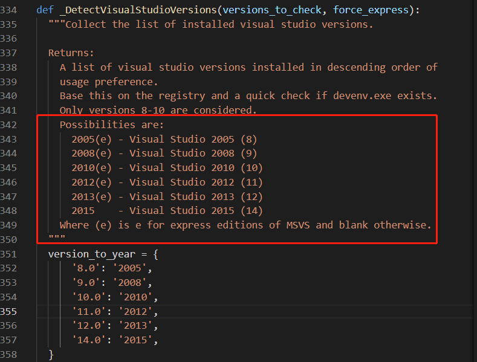
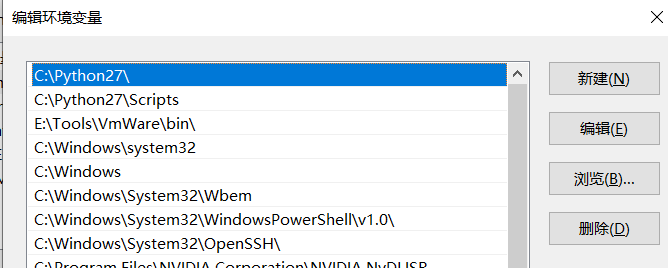

# sass 常见问题

## node-sass@4版本

1. `not find python`
2. `node-gyp` error
3. `window build tool` 中文乱码

::: tip
以上3个问题的本质都是一个问题

:::

## 终极解决方式
1. 安装`python2.7`（设置window环境变量）
   </br>
2. 删除`node-gyp模块` C:\Users\Administrator\.node-gyp
3. 安装`Visual Studio 2015`
4. 设置`编译版本`
   ``` sh
   npm config set msvs_version 2015
   ```
5. 设置`python`版本 (设置window环境变量后，可以不需要这一步)
   ``` sh
   npm config set python /path/to/python2.7
   ```
6. 重新安装`node-sass`
   ``` sh
   npm install -g node-sass@4.11.0 sass-loader@10.1.1
   ```